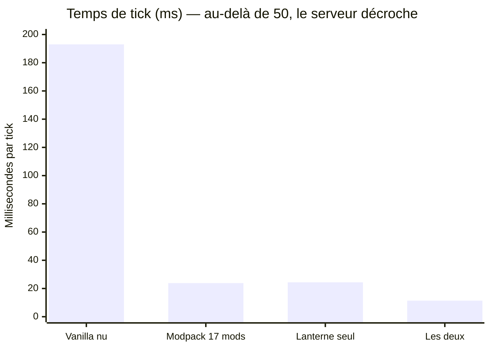
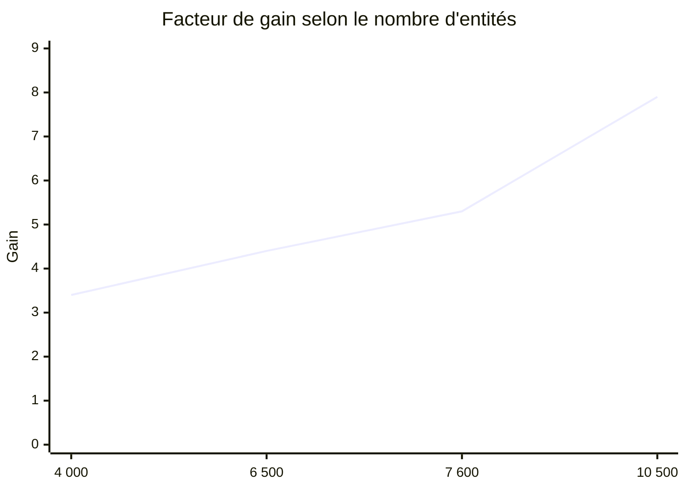
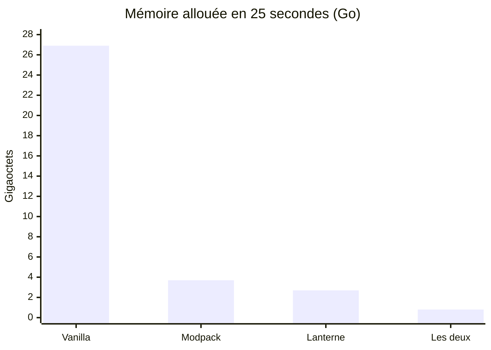
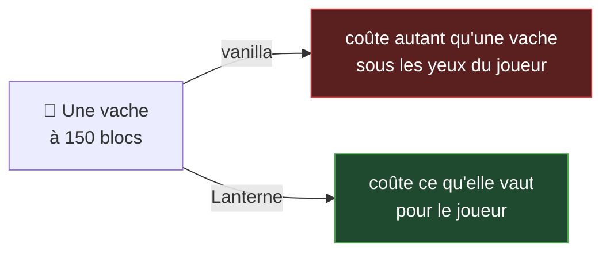
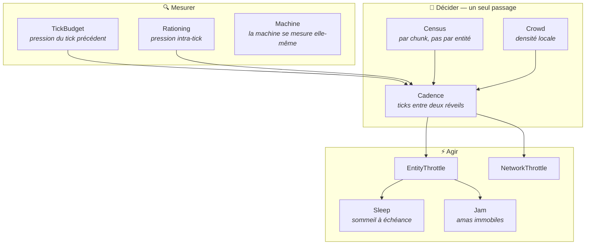

# 🎃 Lanterne

> La citrouille qui éclaire sans brûler.

**Mod d'optimisation serveur pour NeoForge 26.1.2.** Il ne cherche pas à rendre le jeu plus rapide,
mais à lui éviter le travail qui ne sert à rien.

<div align="center">

### Un seul mod fait jeu égal avec dix-sept — et les bat sur la mémoire, sans casser les fermes.

</div>

---

## 📊 Résultats

Monde pré-généré, 10 500 entités, un joueur, distance de simulation 10. Serveur dédié NeoForge
26.1.2, Ryzen 7 5800H. Tous les chiffres sortent de `LANTERNE_SELFTEST` — **aucun n'a été saisi à la
main**. Variance vérifiée sur trois exécutions : 2 %.



| Configuration | ms/tick | vs vanilla | TPS | Mémoire allouée |
|---|---:|---:|:---:|---:|
| Vanilla nu | 193,0 | — | 🔴 **5** | 26,9 Go |
| Modpack d'optimisation (17 mods) | 23,8 | ×8,1 | 🟢 20 | 3,7 Go |
| **Lanterne seul** | **24,4** | **×7,9** | 🟢 **20** | **2,7 Go** |
| Modpack + Lanterne | 11,4 | ×17,0 | 🟢 20 | **0,8 Go** |

<sub>Modpack comparé : Lithium, FerriteCore, ModernFix, ServerCore, Adaptive Performance Tweaks,
AI-Improvements, Immersive Optimization, LetMeDespawn, Clumps et dépendances.</sub>

### Le gain monte avec la charge



C'est la propriété qu'on veut : **le mod s'efface quand le serveur va bien, et travaille d'autant
plus qu'on en a besoin.** Profileur à l'appui — avec Lanterne, le serveur passe **48 % de son temps
à dormir**, tick fini, en attente du suivant.

### Mémoire — ce qui compte sur un petit serveur



Sur un VPS à un cœur, la mémoire n'est pas un confort : un ramassage n'y tourne pas « en
parallèle », il **fige le serveur**. Dix fois moins d'allocations, c'est dix fois moins d'à-coups.

---

## ✅ Conformité — ce qu'aucun autre mod ne mesure

> Un mod d'optimisation qui casse une ferme a échoué, **même à ×10**.

### Chute libre — la mécanique de toutes les fermes à monstres

| Configuration | 16 blocs | 40 blocs | 64 blocs |
|---|:---:|:---:|:---:|
| Vanilla (référence : 20,3 blocs en 25 ticks) | 💚 100 % | 💚 100 % | 💚 100 % |
| **Modpack (17 mods)** | 🔴 **20 %** | 🔴 **20 %** | 🔴 **20 %** |
| **Lanterne** | 💚 **100 %** | 💚 **100 %** | 💚 **93 %** |

> ⚠️ **Le modpack réduit les chutes à un cinquième de leur vitesse**, y compris à seize blocs du
> joueur. Une ferme à chute y produit cinq fois moins — et le joueur l'attribuera à autre chose.

Son ×8,1 est donc payé, en partie, avec du rendement de jeu. **Lanterne a fait la même erreur**, et
l'épreuve l'a rattrapée : la correction lui a coûté sa première place au chronomètre.

### Cuisson — exact au tick près

| | Four 1 | Four 2 | Four 3 | Four 4 | Four 5 |
|---|:---:|:---:|:---:|:---:|:---:|
| Sans Lanterne | 200 | 200 | 200 | 200 | 200 |
| **Avec Lanterne** | **200** | **200** | **200** | **200** | **200** |

Le four ne travaille plus que **deux fois au lieu de deux cents**, et cuit au même tick. Ce n'est pas
un ralentissement compensé : c'est un calcul qu'on cesse de refaire parce qu'on en connaît la réponse.

---

## 💡 La thèse



Lithium rend chaque système du jeu plus rapide, et le fait bien. Lanterne pose une autre question :
**pourquoi ce travail a-t-il lieu ?**

Le jeu ne connaît que deux états — chargé, ou pas chargé. Cette absence de nuance est la source
principale de dépense sur une instance chargée. C'est le principe du **niveau de détail**, vieux de
trente ans dans le rendu 3D, et absent de la simulation de Minecraft.

### Les cinq garanties

| | |
|:---:|---|
| 🛡️ | **Rien n'est dégradé près d'un joueur.** En deçà de 24 blocs, le jeu est le jeu. |
| 🛡️ | **Rien n'est jamais arrêté**, seulement espacé. |
| 🛡️ | **Ce qui produit garde sa cadence.** Villageois et pillards : jamais sous 1 tick sur 4. |
| 🛡️ | **Ce qui tombe tombe.** Chute, projectiles, TNT amorcée, véhicules montés : jamais espacés. |
| 🛡️ | **Quand le serveur va bien, le mod ne fait presque rien.** |

---

## ⚙️ Architecture



### Les décisions qui portent tout

**Recenser des chunks, pas des entités.** L'approche naïve calcule la distance de chaque entité à
chaque joueur : 100 000 entités × 5 joueurs = 500 000 calculs par tick. Mais deux vaches du même
chunk sont à 16 blocs près à la même distance. À 10 chunks : **441 calculs au lieu de 500 000.**

**Une droite, pas des paliers.** Une créature à 100 blocs tombait dans « un tick sur quatre » et y
restait jusqu'à 112. Un palier est un compromis figé : trop prudent en haut de tranche, trop brutal
en bas.

**L'étalement.** La version évidente serait `tick % period == 0`. Elle est fausse, et de la pire
façon : toutes les entités d'une même cadence se réveilleraient **dans le même tick**. La charge ne
baisserait pas, elle se **concentrerait**.

**Le sommeil à échéance.** Un four qui cuit a deux échéances calculables. Entre les deux, rien
d'observable ne se produit — et pourtant chaque tick alloue deux objets et cherche une recette pour
incrémenter un compteur. On ne ralentit pas : **on dort, et l'on rattrape exactement**.

---

## 🔬 Le laboratoire

Un mod d'optimisation qui ne se mesure pas ne vaut rien. Celui-ci embarque de quoi **se réfuter**.

```bash
LANTERNE_SELFTEST="10000:150:1" ./gradlew runServer   # entités:rayon:joueurs
LANTERNE_CONFORMANCE=1          ./gradlew runServer   # l'épreuve de chute
LANTERNE_KITCHEN=1              ./gradlew runServer   # l'épreuve de cuisson
LANTERNE_ALLOC=1                ./gradlew runServer   # qui alloue, et combien
LANTERNE_MODULES="lod,density"  ./gradlew runServer   # un module à la fois
```

En jeu : `/lanterne`, `/lanterne bench`, `/lanterne on|off`.

| Outil | Ce qu'il apporte |
|---|---|
| `Preflight` | **Refuse de mesurer** si les conditions ne sont pas réunies |
| `Bench` | Comparaison A/B, médiane, 200 ticks de chauffe |
| `Sampler` | Profileur par échantillonnage, avec vue « qui appelle qui » |
| `Allocations` | Profileur d'**allocations** (JFR) — qui alloue, et combien |
| `Understudy` | **De vrais joueurs simulés** — ni client, ni réseau |
| `Conformance` | L'épreuve de chute, 5 sujets par distance, médiane |
| `Kitchen` | L'épreuve de cuisson, au tick près |

`Understudy` est la pièce qui rend tout le reste possible : de vrais `ServerPlayer`, inscrits dans la
liste du serveur, avec une connexion qui absorbe les paquets. **Cent doublures coûtent ce que
coûteraient cent joueurs** — sur une machine qui n'en héberge aucun.

### La machine se mesure elle-même

```
Machine : 16 fil(s) annoncé(s), gain parallèle réel ×13.19 — paralléliser vaudrait le coup
Machine :  1 fil(s) annoncé(s), gain parallèle réel ×1.00 — contre-productif, faire moins
```

`Runtime.availableProcessors()` ment souvent : un VPS annoncé à quatre cœurs peut n'en avoir qu'un de
réellement disponible. La documentation de Folia recommande **seize cœurs physiques minimum**, en
deçà desquels l'ordonnancement coûte plus qu'il ne rapporte.

---

## 🧭 Ce que ce projet a appris en se trompant

> Le banc a rendu **huit verdicts négatifs**, et chacun avait raison. Ce qui suit n'est pas une liste
> d'échecs : c'est la raison pour laquelle les chiffres du haut de page sont fiables.

<details>
<summary><b>Deux plans démolis avant d'être codés</b></summary>

<br>

**La compensation des ticks aléatoires.** Ne tirer qu'une fois sur seize, mais seize fois plus. La
loi est préservée — c'est exact — et le gain est **nul** : même nombre total de tirages. Abandonnée
sur une multiplication.

**Le ralentissement des entonnoirs.** Un entonnoir tické une fois sur seize transfère seize fois
moins d'objets, et les chunks concernés sont dans le rayon de simulation — ce sont des fermes *en
marche*. On ne les aurait pas optimisées, on les aurait cassées.
</details>

<details>
<summary><b>Un débordement d'entier qui neutralisait tout le mod</b></summary>

<br>

```java
if (tick - lastRefresh < REFRESH_PERIOD) return;   // lastRefresh = Long.MIN_VALUE
```

`100 - Long.MIN_VALUE` déborde et redevient négatif. La condition était toujours vraie, et **le
recensement ne s'est jamais exécuté** — de la première ligne jusqu'au sixième banc. Le mod compilait,
démarrait, journalisait, et ne faisait rien. Le banc l'a dit en une ligne : `chunks recensés : 0`.
</details>

<details>
<summary><b>Ce qui tombe — l'erreur qui aurait cassé toutes les fermes</b></summary>

<br>

La gravité s'accumule : `v += g` puis `y += v`. Ticker une créature une fois sur quatre ne divise pas
sa chute par quatre **mais par seize**. Mesuré : 7 % de la chute normale à 80 blocs.

Corriger cela a ramené le gain annoncé de ×10,5 à ×3,6. **Le ×10,5 n'était pas un gain, c'était une
dégradation non mesurée.**
</details>

<details>
<summary><b>Trois fois, le banc a menti — et toujours en accusant le mod</b></summary>

<br>

**Les doublures n'étaient pas de vrais joueurs**, puis l'étaient mais en spectateur — que le
recensement ignore — puis n'appartenaient à aucun monde. Dans les trois cas, le mod voyait un serveur
vide et ralentissait tout au maximum.

**Le banc générait le monde pendant qu'il mesurait** : la génération de terrain dominait les
allocations relevées. Corriger cela a fait passer le gain de ×4,4 à ×7,9.

**Le monde conservé gardait les créatures des épreuves précédentes** : l'épreuve de chute a rendu
6 % / 4 % / 0 %, imputés au mod alors que ses sujets étaient simplement noyés dans une foule.

C'est de ces trois mensonges qu'est né `Preflight` : **un banc doit refuser de rendre un chiffre
plutôt qu'en rendre un faux**, parce qu'un chiffre faux ne se corrige pas — il se propage.
</details>

<details>
<summary><b>Ce que le profileur d'allocations a trouvé, et que rien ne laissait deviner</b></summary>

<br>

```
41,0 %  NaturalSpawner.getRandomPosWithin  2,29 Go
11,9 %  Level.getBlockRandomPos            1,58 Go
```

Deux méthodes qui **allouent un objet pour rendre trois entiers**, appelées des dizaines de milliers
de fois par tick. Une position mutable réutilisée suffit — après avoir vérifié, et non supposé, que
rien ne conserve la référence.
</details>

---

## 🗺️ Ce qui vient

| Piste | Attendu | État |
|---|---|---|
| Moteur de lumière | Premier poste d'allocation restant | À mesurer |
| `EntityTickList` à buckets | **Terrain vierge** — personne, pas même Moonrise, ne le remplace | À prouver |
| Redstone (*Alternate Current*) | ×10-100 sur gros circuits | ⚠️ Casse les TNT dupers — hors garanties |
| Tick parallèle par régions | Nul sous 16 cœurs | Verdict rendu, non implémenté |

## ⚠️ Cohabitation

**Immersive Optimization fait du tick scheduling par distance, comme Lanterne.** Les deux
appliqueraient leur dégradation l'un sur l'autre. Le retirer avant de juger.
