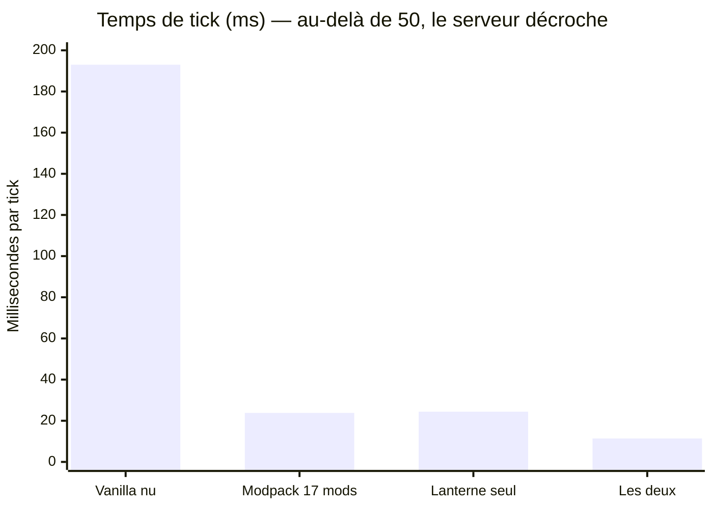
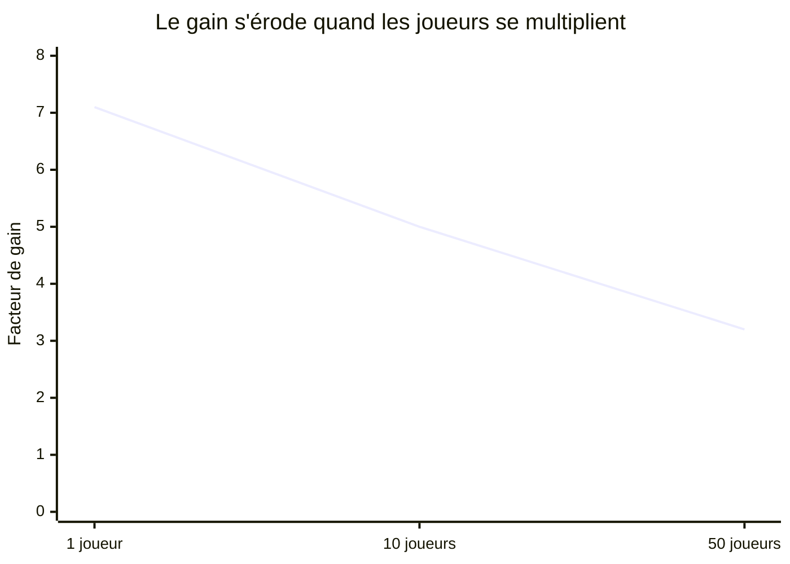
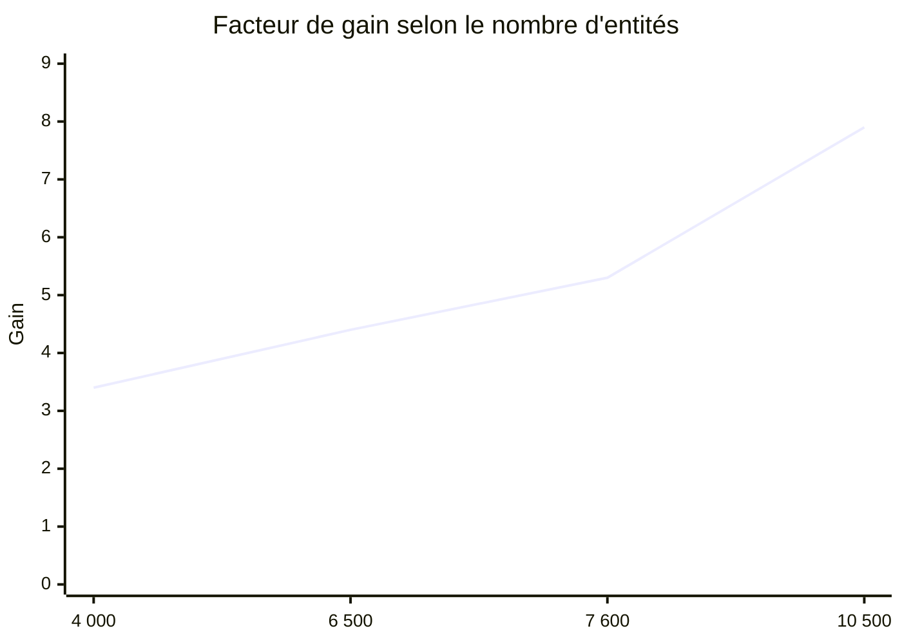
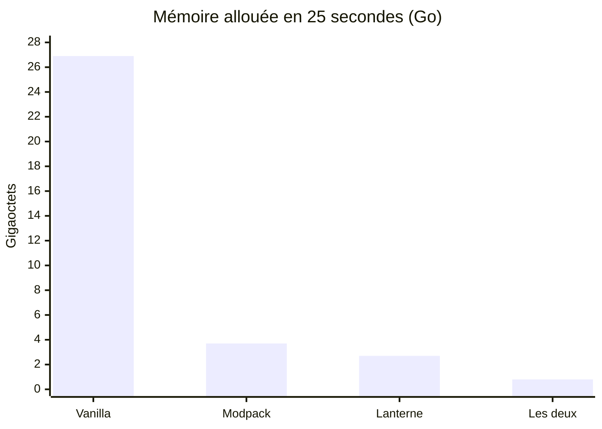
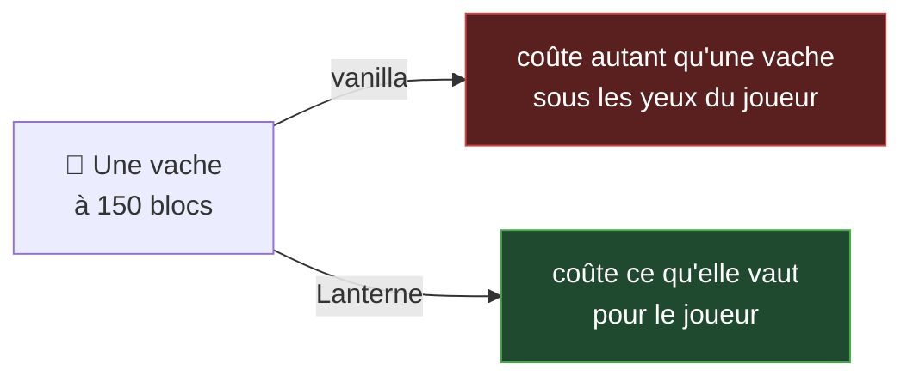
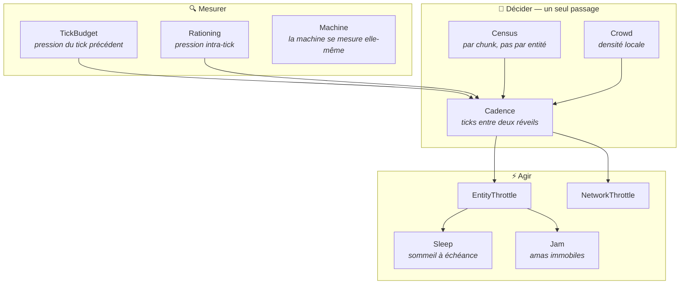

# 🎃 Lanterne

> La citrouille qui éclaire sans brûler.

**Mod d'optimisation serveur pour NeoForge 26.1.2.** Il ne cherche pas à rendre le jeu plus rapide,
mais à lui éviter le travail qui ne sert à rien.

<div align="center">

### Un seul mod fait jeu égal avec dix-sept — et les bat sur la mémoire, sans casser les fermes.

**×42** sur une base habitée · **×62** sur un sol jonché · **×7,1** sur un serveur peuplé

*Et le chiffre qui n'arrange pas : **×3,2 seulement à cinquante joueurs**, où les vingt ticks ne sont
pas tenus. La raison est expliquée plus bas, pas cachée.*

*Rendement d'une ferme : **100 %**, mesuré. Aucun autre mod d'optimisation ne publie ce chiffre.*

</div>

---

## 📊 Résultats

Monde pré-généré, un joueur, distance de simulation 10. Serveur dédié NeoForge
26.1.2, Ryzen 7 5800H. Tous les chiffres sortent de `LANTERNE_SELFTEST` — **aucun n'a été saisi à la
main**. Les chiffres du tableau ci-dessous sont la médiane de trois exécutions ; ceux du grand
tableau plus bas datent d'une exécution unique et sont signalés comme tels.



| Configuration | ms/tick | vs vanilla | TPS | Mémoire allouée |
|---|---:|---:|:---:|---:|
| Vanilla nu | 193,0 | — | 🔴 **5** | 26,9 Go |
| Modpack d'optimisation (17 mods) | 23,8 | ×8,1 | 🟢 20 | 3,7 Go |
| **Lanterne seul** | **24,4** | **×7,9** | 🟢 **20** | **2,7 Go** |
| Modpack + Lanterne | 11,4 | ×17,0 | 🟢 20 | **0,8 Go** |

<sub>Modpack comparé : Lithium, FerriteCore, ModernFix, ServerCore, Adaptive Performance Tweaks,
AI-Improvements, Immersive Optimization, LetMeDespawn, Clumps et dépendances.</sub>

### Quatre charges, et non une moyenne

Un chiffre unique cache l'essentiel : **ce qui met un serveur à genoux n'est jamais homogène.** Les
entités réparties en anneau sont la charge la plus facile à mesurer et la moins représentative. Les
autres reproduisent les plaintes réelles des administrateurs.

La dernière ligne du tableau est la plus intéressante : c'est une **base habitée**, avec son élevage et
son sol jonché en même temps. Sans le mod, un tick y dure deux tiers de seconde — le serveur tourne à
1,5 TPS et le jeu est perdu. Avec, il tient ses vingt ticks avec de la marge.

```mermaid
xychart-beta
    title "Millisecondes par tick — échelle logarithmique impossible, lisez les chiffres"
    x-axis ["10 500 entites", "1 000 vaches 15x15", "8 000 objets", "base habitee"]
    y-axis "ms par tick" 0 --> 1150
    bar [202.9, 28.4, 463.5, 1134.8]
    bar [28.2, 5.4, 7.4, 26.9]
```



| Charge | Sans Lanterne | Avec Lanterne | Gain | Ce qu'elle reproduit |
|---|---:|---:|---:|---|
| 10 500 entités sur un anneau de 160 blocs | 202,9 ms | **28,2 ms** | **×7,1** | un serveur peuplé, gradient de distance |
| 1 000 vaches dans un carré de 15 blocs | 28,4 ms | **5,4 ms** | **×5,2** | un élevage intensif, coût quadratique |
| 8 000 piles d'objets au sol | 463,5 ms | **7,4 ms** | **×62,4** | une ferme qui déborde, un sol jonché |
| **4 000 vaches en enclos + 4 000 objets** | **1 134,8 ms** | **26,9 ms** | **×42** | une base habitée : élevage *et* sol jonché |

<sub>Les deux dernières ne sont pas des aberrations de mesure : sans le mod, un tick y dure **463** puis
**661 ms**, et le
chien de garde du serveur finit par le déclarer planté. Le détail de l'analyse est plus bas —
`Entity.canBeCollidedWith()` rend faux par défaut, et trois classes seulement le redéfinissent dans
tout Minecraft.</sub>

### Quel module fait quoi — et la surprise

Chaque module a son interrupteur, ce qui permet de le mesurer **seul**. Sur la charge « base
habitée » :

| Modules actifs | Travail évité | Gain |
|---|---:|---:|
| `lod` seul — dégrader ce qui est **loin** | 🔴 **0,8 %** | aucun |
| `lod` + `densite` — et ce qui est **entassé** | 💚 **93,3 %** | **×10,7** |
| `collisions` seul — le court-circuit de `Solid` | — | **×2,34** |
| tout ensemble | — | **×42** |

**La première ligne est le résultat le plus dérangeant de ce projet.** La thèse d'origine — « dégrader
ce qui est loin d'un joueur » — ne fait *rien* sur une base habitée. C'est normal, et il fallait le
mesurer pour le voir : un élevage et un sol jonché sont **à vingt blocs du joueur**, dans la zone que
le mod s'interdit de toucher.

Ce qui porte le gain, là où les joueurs vivent réellement, c'est la **densité** : ce qui est noyé dans
le nombre ne se distingue pas, qu'il soit loin ou sous vos yeux.

> C'est aussi ce qui justifie le changement le plus important de la dernière passe : la dégradation
> par densité est passée d'un facteur 4 à un facteur **16**. Elle ne pouvait pas monter tant que
> ralentir une bête arrêtait sa ponte et sa croissance. Une fois les horloges de production tenues à
> la main, elle l'a pu — et le gain sur l'élevage est passé de ×3,0 à ×5,2.

### Dix joueurs — la charge que ce mod n'avait jamais mesurée

Tous les chiffres ci-dessus portent sur **un** observateur. C'était une lacune : un serveur, par
définition, en a plusieurs, et chacun apporte ses chunks, son suivi d'entités et son flux de paquets.

| 10 joueurs, 11 441 entités, 1 881 chunks | ms/tick | TPS |
|---|---:|:---:|
| Sans Lanterne | 222,2 | 🔴 **4,5** |
| **Avec Lanterne** | **44,8** | 🟢 **20** |

**×5,0** (deux exécutions : ×4,73 et ×4,96). Sans le mod, ce serveur est injouable ; avec, il tient
ses vingt ticks — de justesse, et c'est dit : 45 ms sur 50 disponibles, la marge est mince.

Le réseau suit le même gradient : **560 paquets par tick sans le mod, 387 avec** (×1,45). C'est ce qui
compte pour un joueur en mauvaise connexion, et ce que le serveur décide d'émettre est la seule part
sur laquelle un mod puisse agir.

<sub>Il a fallu trois tentatives pour obtenir cette mesure, et les deux premières ont été **refusées
par le contrôle préalable** : 18 entités vivantes sur 10 500, puis 962. Dix doublures espacées de 500
blocs réclament 6 250 chunks, que le gestionnaire de distance ne livre pas dans le temps imparti — les
vaches naissaient dans des chunks inexistants. Sans ce refus, le banc aurait comparé deux mondes
presque vides et annoncé « aucun effet » avec aplomb. Les joueurs sont désormais posés à 128 blocs les
uns des autres, ce qui est aussi beaucoup plus proche de la réalité : sur un serveur entre amis, on
est ensemble.</sub>

### Et à cinquante joueurs — le chiffre qui n'arrange pas



| 50 joueurs, 13 378 entités, 5 529 chunks | ms/tick | TPS |
|---|---:|:---:|
| Sans Lanterne | 283,9 | 🔴 **3,5** |
| **Avec Lanterne** | **87,9** | 🟠 **11** |

**Lanterne ne suffit pas à cinquante joueurs sur cette charge.** Le gain est réel — ×3,2, et un
serveur à 3,5 TPS devient un serveur à 11 — mais les vingt ticks par seconde ne sont pas tenus.

La raison est structurelle, et elle mérite d'être comprise plutôt que masquée : **ce mod dégrade ce
qui est loin de tout joueur.** Plus il y a de joueurs, moins il existe d'endroits éloignés de tous, et
moins il reste de travail à éviter. Le gain passe de ×7,1 à ×3,2 pour cette raison précise, pas parce
que le mod fonctionne moins bien.

> C'est aussi pourquoi la cible assumée de ce mod est le **petit serveur** — une poignée d'amis, une
> ou deux bases, un VPS à un ou deux cœurs. C'est là qu'il donne le meilleur, et c'est là qu'il a été
> conçu.

### Mémoire occupée, et non seulement allouée

Le tableau ci-dessus mesure le **débit d'allocation** — combien d'octets le serveur demande par
seconde. C'est lui qui commande la fréquence des ramassages, donc des à-coups.

Il ne dit rien de la question qu'un administrateur se pose vraiment : *combien de mémoire faut-il
donner à ce serveur ?* La réponse est l'ensemble vivant, ce qui reste occupé **après un ramassage
complet** — que le banc provoque au lieu de l'attendre.

| Charge de référence | Occupation après ramassage |
|---|---:|
| Sans Lanterne | 446,7 Mo |
| **Avec Lanterne** | **376,9 Mo** |

**69,8 Mo de moins**, sur un serveur qui n'a rien déchargé. Le gain est modeste comparé au facteur
sept sur les allocations — et le dire ainsi vaut mieux que de laisser confondre les deux chiffres.

### Le gain monte avec la charge



C'est la propriété qu'on veut : **le mod s'efface quand le serveur va bien, et travaille d'autant
plus qu'on en a besoin.** Profileur à l'appui — avec Lanterne, le serveur passe **48 % de son temps
à dormir**, tick fini, en attente du suivant.

### Mémoire — ce qui compte sur un petit serveur



Sur un VPS à un cœur, la mémoire n'est pas un confort : un ramassage n'y tourne pas « en
parallèle », il **fige le serveur**. Dix fois moins d'allocations, c'est dix fois moins d'à-coups.

### Sauvegarde — le réglage à trois lettres que personne n'active

Minecraft sait écrire ses fichiers de région en **LZ4** depuis longtemps. Il ne le fait pas :
`region-file-compression` vaut `deflate` par défaut. Mesuré sur 64 chunks, 10 relevés par
compression :

| Compression | Temps de sauvegarde | Place sur disque |
|---|---:|---:|
| `deflate` (défaut) | 125,32 ms | 20,4 Ko/chunk |
| **`lz4`** | **33,42 ms** | ~24 Ko/chunk |

**×3,7 sur la sauvegarde, sans une ligne de code**, pour environ 20 % de place en plus. Sur un petit
serveur, la sauvegarde s'exécute sur le fil principal : chaque hoquet se voit.

Et la bascule est sans risque — la version de compression est inscrite dans l'en-tête de **chaque
chunk**, donc un monde écrit en `deflate` se relit sans rien convertir.

> Lanterne ne modifie pas votre `server.properties` : la configuration d'un serveur appartient à
> celui qui l'administre. Il le **détecte au démarrage** et affiche le conseil avec son chiffre.

### Génération de chunks — l'ordre de grandeur qui recadre le sujet

| Opération | Coût médian par chunk |
|---|---:|
| **Générer** un chunk neuf | **37 ms** |
| Relire un chunk déjà généré | **6,8 ms** |

Générer un chunk coûte donc presque **un tick entier**, et cinq fois et demie ce que coûte le
relire. C'est le vrai goulot de l'exploration, et Lanterne n'y touche **pas encore** — le dire est
plus utile que de le laisser croire.

<sub>Ce banc a fallu le réparer deux fois avant de le croire. Sa première version générait une région
avec le mod et une autre sans, à des coordonnées éloignées — seule façon apparente de contourner le
fait qu'un chunk généré ne se régénère pas. Verdict : « perte ×0,83 ». Sauf qu'une montagne coûte
plus cher qu'une plaine, et rien dans ce chiffre ne disait laquelle on avait tirée. Il alterne
désormais **à l'intérieur d'une seule grille** — un chunk avec le mod, le suivant sans — et rend
« aucun effet mesurable », ce qui est très exactement l'attendu pour un mod qui ne touche pas à la
génération. Son régime chargement annonçait auparavant un gain de ×30, impossible ; il est retombé à
×0,89.</sub>

---

## ✅ Conformité — ce qu'aucun autre mod ne mesure

> Un mod d'optimisation qui casse une ferme a échoué, **même à ×10**.

### Chute libre — la mécanique de toutes les fermes à monstres

| Configuration | 16 blocs | 40 blocs | 64 blocs |
|---|:---:|:---:|:---:|
| Vanilla (référence : 20,3 blocs en 25 ticks) | 💚 100 % | 💚 100 % | 💚 100 % |
| **Modpack (17 mods)** | 🔴 **20 %** | 🔴 **20 %** | 🔴 **20 %** |
| **Lanterne** | 💚 **100 %** | 💚 **100 %** | 💚 **93 %** |

> ⚠️ **Le modpack réduit les chutes à un cinquième de leur vitesse**, y compris à seize blocs du
> joueur. Une ferme à chute y produit cinq fois moins — et le joueur l'attribuera à autre chose.

Son ×8,1 est donc payé, en partie, avec du rendement de jeu. **Lanterne a fait la même erreur**, et
l'épreuve l'a rattrapée : la correction lui a coûté sa première place au chronomètre.

### Rendement — le défaut que ce mod s'est découvert à lui-même

C'est la découverte la plus importante de ce projet, et elle est arrivée tard.

Les compteurs qui font le **rendement** d'une ferme ne sont pas rangés à part dans Minecraft. Ils
vivent au milieu de l'intelligence, dans les `aiStep()` des sous-classes :

```java
Chicken.aiStep    : if (--this.eggTime <= 0) { ... pond un œuf ... }
AgeableMob.aiStep : if (this.canAgeUp()) this.setAge(++age);
Animal.aiStep     : if (this.inLove > 0) this.inLove--;
```

Tant que ralentir une créature voulait dire **annuler son tick**, ces trois horloges s'arrêtaient avec
elle. Mesuré, à 120 blocs d'un joueur :

| | Œufs pondus | Croissance des petits |
|---|:---:|:---:|
| Lanterne avant la correction | 🔴 **3 %** | 🔴 **19 %** |
| **Lanterne après** | 💚 **100 %** | 💚 **100 %** |

**Une ferme à œufs éloignée perdait 97 % de sa production.** Aucune des trois épreuves existantes ne
pouvait le voir : l'une mesure les chutes, l'autre les fours, la troisième la vitesse. Personne ne
mesurait la production.

> Le remède n'est pas de ralentir moins. C'est de **tenir les horloges à la main** pendant le
> sommeil — un veau vieillit, un délai de reproduction s'écoule, et une poule est réveillée juste
> avant sa ponte pour que l'œuf sorte au tick exact.

Et c'est ce qui a permis d'aller **plus loin** ensuite : puisque la cadence ne coûte plus de
production, la dégradation des foules a pu passer d'un facteur 4 à un facteur 16. Le gain sur
l'élevage intensif est passé de ×3,0 à ×5,3 — payé par la correction, pas malgré elle.

### Objets au sol — disparition au tick exact

Un sol jonché donne le plus gros chiffre du projet (×62). Il ne vaudrait rien si un objet ralenti
cessait de disparaître : le sol s'accumulerait, et le gain deviendrait une fuite de mémoire.

C'est exactement ce qui arrivait. La cadence annule le tick d'un objet, or **son horloge d'âge vit
dans ce tick** : durée de vie demandée 120 ticks, obtenue 152, sur les 40 objets mesurés. Le remède
est le même que pour la ponte des poules — tenir l'horloge à la main pendant le sommeil.

| Vérification | Résultat |
|---|---|
| Disparition (durée de vie imposée 120 ticks) | 💚 **0 objet décalé sur 40**, écart maximal 0 tick |
| Aspiration par une trémie | 💚 identique, avec et sans |
| Ramassage par un joueur | ⚪ **non mesuré** — une doublure n'exécute pas son `aiStep` |
| **Un bateau bloque-t-il encore ?** | 💚 raccourci **refusé** sur sa boîte, **autorisé** ailleurs |

<sub>La dernière ligne teste le mécanisme le plus risqué du mod. `Solid` supprime les recherches de
collision parce que trois classes seulement peuvent bloquer dans tout Minecraft — mais si c'était mal
implémenté, le symptôme ne serait pas un ralentissement : ce serait **une créature qui traverse un
bateau**. Aucune autre épreuve n'aurait pu le voir. Les deux réponses comptent autant l'une que
l'autre : un mécanisme qui refuserait toujours serait sûr et inutile.</sub>

<sub>La dernière ligne est affichée telle quelle plutôt que présentée comme réussie. Ce projet a déjà
annoncé « exact au tick près » en comparant deux fours qui n'avaient cuit ni l'un ni l'autre.</sub>

### Cuisson — exact au tick près

| | Four 1 | Four 2 | Four 3 | Four 4 | Four 5 |
|---|:---:|:---:|:---:|:---:|:---:|
| Sans Lanterne | 200 | 200 | 200 | 200 | 200 |
| **Avec Lanterne** | **200** | **200** | **200** | **200** | **200** |

Le four ne travaille plus que **deux fois au lieu de deux cents**, et cuit au même tick. Ce n'est pas
un ralentissement compensé : c'est un calcul qu'on cesse de refaire parce qu'on en connaît la réponse.

---

## 💡 La thèse



Lithium rend chaque système du jeu plus rapide, et le fait bien. Lanterne pose une autre question :
**pourquoi ce travail a-t-il lieu ?**

Le jeu ne connaît que deux états — chargé, ou pas chargé. Cette absence de nuance est la source
principale de dépense sur une instance chargée. C'est le principe du **niveau de détail**, vieux de
trente ans dans le rendu 3D, et absent de la simulation de Minecraft.

### Les cinq garanties

| | |
|:---:|---|
| 🛡️ | **Le rendement ne dépend jamais de la cadence.** Ponte, croissance, reproduction, durée de vie des objets : tenus au tick exact, quelle que soit la distance. **Mesuré, pas promis.** |
| 🛡️ | **Rien n'est jamais arrêté**, seulement espacé. |
| 🛡️ | **Ce qui produit garde sa cadence.** Villageois et pillards : jamais sous 1 tick sur 4. |
| 🛡️ | **Ce qui tombe tombe.** Chute, projectiles, TNT amorcée, véhicules montés : jamais espacés. |
| 🛡️ | **Une bête isolée près d'un joueur** n'est pas touchée : en deçà de 24 blocs, le jeu est le jeu. |
| 🛡️ | **Quand le serveur va bien, le mod ne fait presque rien.** |

### Et ce qui est dégradé, dit franchement

| | |
|:---:|---|
| ⚖️ | **Dans une foule, une bête réfléchit jusqu'à 16 fois moins souvent** — y compris à sept blocs du joueur. Elle continue de vieillir, de pondre et de se reproduire à l'heure ; c'est sa *décision* qui est espacée, pas sa production. |
| ⚖️ | **Dans un tas, la bousculade est plafonnée** à 26 voisines au lieu de toutes. Dans un tas de deux cents, personne ne peut dire qui a poussé qui. |

<sub>La première ligne de ce tableau corrige une garantie que ce README affichait à tort : il
promettait « rien n'est dégradé près d'un joueur » alors que la dégradation par densité s'applique à
sept blocs comme à cent. Une garantie inexacte est pire qu'une garantie absente — elle empêche celui
qui constate un écart de soupçonner le bon coupable.</sub>

---

## ⚙️ Architecture



### Les décisions qui portent tout

**Recenser des chunks, pas des entités.** L'approche naïve calcule la distance de chaque entité à
chaque joueur : 100 000 entités × 5 joueurs = 500 000 calculs par tick. Mais deux vaches du même
chunk sont à 16 blocs près à la même distance. À 10 chunks : **441 calculs au lieu de 500 000.**

**Une droite, pas des paliers.** Une créature à 100 blocs tombait dans « un tick sur quatre » et y
restait jusqu'à 112. Un palier est un compromis figé : trop prudent en haut de tranche, trop brutal
en bas.

**L'étalement.** La version évidente serait `tick % period == 0`. Elle est fausse, et de la pire
façon : toutes les entités d'une même cadence se réveilleraient **dans le même tick**. La charge ne
baisserait pas, elle se **concentrerait**.

**Le sommeil à échéance.** Un four qui cuit a deux échéances calculables. Entre les deux, rien
d'observable ne se produit — et pourtant chaque tick alloue deux objets et cherche une recette pour
incrémenter un compteur. On ne ralentit pas : **on dort, et l'on rattrape exactement**.

---

## 🔬 Le laboratoire

Un mod d'optimisation qui ne se mesure pas ne vaut rien. Celui-ci embarque de quoi **se réfuter**.

```bash
LANTERNE_SELFTEST="10000:150:1" ./gradlew runServer   # entités:rayon:joueurs
LANTERNE_CONFORMANCE=1          ./gradlew runServer   # l'épreuve de chute
LANTERNE_KITCHEN=1              ./gradlew runServer   # l'épreuve de cuisson
LANTERNE_ALLOC=1                ./gradlew runServer   # qui alloue, et combien
LANTERNE_MODULES="lod,density"  ./gradlew runServer   # un module à la fois
```

En jeu : `/lanterne`, `/lanterne bench`, `/lanterne on|off`.

| Outil | Ce qu'il apporte |
|---|---|
| `Preflight` | **Refuse de mesurer** si les conditions ne sont pas réunies |
| `Bench` | Comparaison A/B, médiane, chauffe **et échéance** — un banc doit toujours finir |
| `Scene` | Les charges d'essai : anneau, **enclos intensif**, **sol jonché d'objets** |
| `Sampler` | Profileur par échantillonnage — parts sur le **travail réel**, pas sur l'attente |
| `Allocations` | Profileur d'**allocations** (JFR) — qui alloue, et combien |
| `Understudy` | **De vrais joueurs simulés** — ni client, ni réseau |
| `Conformance` | L'épreuve de chute, 5 sujets par distance, médiane |
| `Kitchen` | L'épreuve de cuisson, au tick près |
| **`Yield`** | **L'épreuve de rendement** — œufs pondus, croissance des petits |
| **`Tidy`** | **L'épreuve des objets** — disparition, trémie, ramassage, et le bateau qui doit bloquer |
| **`Boom`** | Le coût d'une explosion, à charge reconstituée avant chaque tir |
| **`Flow`** | Le coût d'un écoulement d'eau, par différence avec un bassin sec |
| **`Quarry`** | Génération **contre** chargement de chunks, mesurés séparément |
| **`Vault`** | Sauvegarde sur disque : **temps et place**, jamais l'un sans l'autre |
| **`Glass`** | Images par seconde côté client, sans intervention humaine |

<sub>Les sept derniers ont été construits en une nuit. Deux d'entre eux ont immédiatement trouvé des
défauts dans le mod — `Yield` les 97 % de rendement perdus, `Tidy` les objets qui ne disparaissaient
plus à l'heure. Un banc qui ne trouve rien n'a pas encore prouvé qu'il fonctionne.</sub>

### Sept outils qui savent refuser de conclure

C'est la propriété la plus utile du laboratoire, et la plus difficile à obtenir : **un banc qui
préfère dire « je ne sais pas ».**

| Cas rencontré cette nuit | Ce que le banc a fait |
|---|---|
| Débit d'une chaîne de trémies : 18/30, puis 39/16, puis 16/16 | **refuse de citer le chiffre** — trois exécutions identiques, résultats incohérents |
| Chargement de chunks : « gain ×30 » | **rejette son propre verdict** — aucun module ne touche au chargement, donc c'est le protocole |
| Coût d'un écoulement d'eau : différence négative | **refuse de publier un ratio** — le signal est sous le bruit |
| Ramassage par un joueur : « non » des deux côtés | **dit « non mesuré »** — une doublure n'exécute pas son `aiStep` |
| Charge témoin à 135 ms/tick, 500 ticks demandés | **s'arrête à l'échéance** et dit sur combien de relevés il conclut |

`Understudy` est la pièce qui rend tout le reste possible : de vrais `ServerPlayer`, inscrits dans la
liste du serveur, avec une connexion qui absorbe les paquets. **Cent doublures coûtent ce que
coûteraient cent joueurs** — sur une machine qui n'en héberge aucun.

### La machine se mesure elle-même

```
Machine : 16 fil(s) annoncé(s), gain parallèle réel ×13.19 — paralléliser vaudrait le coup
Machine :  1 fil(s) annoncé(s), gain parallèle réel ×1.00 — contre-productif, faire moins
```

`Runtime.availableProcessors()` ment souvent : un VPS annoncé à quatre cœurs peut n'en avoir qu'un de
réellement disponible. La documentation de Folia recommande **seize cœurs physiques minimum**, en
deçà desquels l'ordonnancement coûte plus qu'il ne rapporte.

---

## 🧭 Ce que ce projet a appris en se trompant

> Le banc a rendu **quinze verdicts négatifs**, et chacun avait raison. Ce qui suit n'est pas une
> liste d'échecs : c'est la raison pour laquelle les chiffres du haut de page sont fiables.

<details>
<summary><b>🔴 Quatre fois où l'outil de mesure mentait, et non le mod</b></summary>

<br>

C'est la catégorie la plus dangereuse. Un mod lent se voit ; **un banc faux se croit**.

**Le profileur diluait tout dans l'attente.** Un serveur qui tient ses 20 ticks par seconde passe le
plus clair de son temps à dormir. 76 % des relevés surprenaient le serveur au repos, et tous les
postes étaient donc divisés par quatre : `EntitySection.getEntities` passait pour 5,6 % alors qu'il
pesait **24 % du travail réel**. Un profil qui sous-évalue d'un facteur quatre le poste le plus lourd
ne désigne pas la bonne cible.

**Le rapport décrivait la phase témoin.** Le verdict s'écrit à la fin de la seconde phase, mod
éteint — il lisait donc des compteurs remis à plat. Il annonçait « travail évité : 4,5 % » là où la
mesure réelle est 90 %. Deux chiffres du même rapport se contredisaient ; c'est ce qui a mis la puce
à l'oreille.

**Le banc ne finissait pas.** Le protocole demandait 700 ticks par exécution, en supposant sans le
dire qu'un tick dure 50 ms. Sur la charge des objets au sol, un tick durait **135 secondes** : 26
heures d'attente. Il ne rendait pas un chiffre faux, il ne rendait rien — ce qui est pire.

**Deux protocoles fabriquaient leur propre écart.** La chaîne de trémies n'était pas vidée entre les
phases (136 objets arrivés au bout d'une chaîne qui n'en reçoit que 64) et le relevé se faisait sur
deux durées différentes. L'écart de 18 % imputé au mod venait entièrement du banc.
</details>

<details>
<summary><b>🐣 Le défaut le plus grave : 97 % du rendement d'une ferme</b></summary>

<br>

Les compteurs de production vivent **dans** le tick, mêlés à l'intelligence : `eggTime` pour la
ponte, `age` pour la croissance, `inLove` pour la reproduction. Annuler le tick d'une créature —
c'est-à-dire la façon la moins coûteuse de ne rien faire — arrêtait ces trois horloges.

Une poule à 120 blocs pondait **3 %** de sa production normale. Un veau grandissait à **19 %** de sa
vitesse. Le mod tenait sa promesse de vitesse en prélevant la différence sur la production, sans le
savoir, et sans qu'aucune de ses trois épreuves ne puisse le voir.

Deux remèdes ont été écrits et mesurés. Le premier — laisser le tick s'exécuter et n'en retirer que
l'intelligence — est plus élégant, plus général, et couvre automatiquement les créatures des mods. Le
banc l'a chiffré : **14,31 ms contre 10,01**. Il est conservé, mais en option.

Le second, retenu : tenir les horloges à la main pendant le sommeil. Et c'est lui qui a permis
d'aller *plus loin* — puisque la cadence ne coûte plus de production, la dégradation des foules a pu
passer d'un facteur 4 à 16.
</details>

<details>
<summary><b>💤 Le sommeil des objets — l'idée phare, écartée par son propre banc</b></summary>

<br>

C'était l'innovation la mieux fondée de ce projet. Un objet posé au sol refait vingt fois par seconde
une requête de collision complète dont la réponse n'a pas changé depuis trois minutes — et l'on pouvait
démontrer, code du jeu à l'appui, que l'endormir ne cassait **rien** : c'est le joueur qui ramasse, la
trémie qui aspire, l'explosion qui cherche.

Quatre fichiers, deux mixins, un compteur de modifications par section de chunk pour le réveil
événementiel, une épreuve de conformité dédiée. Et deux bugs à corriger avant qu'il ne fonctionne :

**La condition ne se déclenchait jamais.** Elle exigeait une vitesse nulle. Or un objet posé au sol
n'a **jamais** une vitesse nulle en vanilla : `applyGravity()` lui retire 0,04 en y à chaque tick, et
le sol ne les lui rend qu'un tick sur quatre. Le bon critère est le **déplacement réel**.

**Le compteur comptait les mauvais ticks.** Il s'incrémentait à chaque passage — mais la dégradation
par densité ralentit déjà un tas d'objets à un tick sur seize. Atteindre 45 demandait **720 ticks de
jeu**. Deux modules du même mod se gênaient sans que rien ne le signale.

Une fois réparé, il a été mesuré. Et **retiré** :

| | |
|---|---|
| module seul, 2 000 objets | 38,46 contre 38,84 ms → **aucun effet** |
| tout **sauf** lui, 8 000 objets | **×62,24** |
| tout **avec** lui, 8 000 objets | ×62,36 |

La cadence et le court-circuit de collision faisaient déjà tout le travail ; le sommeil n'arrivait
qu'après eux, sur un tick déjà supprimé.

**Ce que son retrait laisse en place est la vraie trouvaille.** En cherchant pourquoi la disparition
des objets était décalée — 152 ticks au lieu de 120 — on a découvert que la cadence arrêtait leur
horloge d'âge, exactement comme elle arrêtait la ponte des poules. Cette correction reste, et
l'épreuve confirme 0 décalage sur 40 objets **sans** le module de sommeil.

Le retrait supprime au passage un mixin sur `LevelChunk.setBlockState` — sur **chaque pose de bloc du
serveur**. Un chemin très chaud, allégé pour de bon.
</details>

<details>
<summary><b>Deux plans démolis avant d'être codés</b></summary>

<br>

**La compensation des ticks aléatoires.** Ne tirer qu'une fois sur seize, mais seize fois plus. La
loi est préservée — c'est exact — et le gain est **nul** : même nombre total de tirages. Abandonnée
sur une multiplication.

**Le ralentissement des entonnoirs.** Un entonnoir tické une fois sur seize transfère seize fois
moins d'objets, et les chunks concernés sont dans le rayon de simulation — ce sont des fermes *en
marche*. On ne les aurait pas optimisées, on les aurait cassées.
</details>

<details>
<summary><b>Un débordement d'entier qui neutralisait tout le mod</b></summary>

<br>

```java
if (tick - lastRefresh < REFRESH_PERIOD) return;   // lastRefresh = Long.MIN_VALUE
```

`100 - Long.MIN_VALUE` déborde et redevient négatif. La condition était toujours vraie, et **le
recensement ne s'est jamais exécuté** — de la première ligne jusqu'au sixième banc. Le mod compilait,
démarrait, journalisait, et ne faisait rien. Le banc l'a dit en une ligne : `chunks recensés : 0`.
</details>

<details>
<summary><b>Ce qui tombe — l'erreur qui aurait cassé toutes les fermes</b></summary>

<br>

La gravité s'accumule : `v += g` puis `y += v`. Ticker une créature une fois sur quatre ne divise pas
sa chute par quatre **mais par seize**. Mesuré : 7 % de la chute normale à 80 blocs.

Corriger cela a ramené le gain annoncé de ×10,5 à ×3,6. **Le ×10,5 n'était pas un gain, c'était une
dégradation non mesurée.**
</details>

<details>
<summary><b>Trois fois, le banc a menti — et toujours en accusant le mod</b></summary>

<br>

**Les doublures n'étaient pas de vrais joueurs**, puis l'étaient mais en spectateur — que le
recensement ignore — puis n'appartenaient à aucun monde. Dans les trois cas, le mod voyait un serveur
vide et ralentissait tout au maximum.

**Le banc générait le monde pendant qu'il mesurait** : la génération de terrain dominait les
allocations relevées. Corriger cela a fait passer le gain de ×4,4 à ×7,9.

**Le monde conservé gardait les créatures des épreuves précédentes** : l'épreuve de chute a rendu
6 % / 4 % / 0 %, imputés au mod alors que ses sujets étaient simplement noyés dans une foule.

C'est de ces trois mensonges qu'est né `Preflight` : **un banc doit refuser de rendre un chiffre
plutôt qu'en rendre un faux**, parce qu'un chiffre faux ne se corrige pas — il se propage.
</details>

<details>
<summary><b>Ce que le profileur d'allocations a trouvé, et que rien ne laissait deviner</b></summary>

<br>

```
41,0 %  NaturalSpawner.getRandomPosWithin  2,29 Go
11,9 %  Level.getBlockRandomPos            1,58 Go
```

Deux méthodes qui **allouent un objet pour rendre trois entiers**, appelées des dizaines de milliers
de fois par tick. Une position mutable réutilisée suffit — après avoir vérifié, et non supposé, que
rien ne conserve la référence.
</details>

---

## 🗺️ Ce qui vient

| Piste | Attendu | État |
|---|---|---|
| Moteur de lumière | Premier poste d'allocation restant | À mesurer |
| `EntityTickList` à buckets | **Terrain vierge** — personne, pas même Moonrise, ne le remplace | À prouver |
| Redstone (*Alternate Current*) | ×10-100 sur gros circuits | ⚠️ Casse les TNT dupers — hors garanties |
| Tick parallèle par régions | Nul sous 16 cœurs | Verdict rendu, non implémenté |

## ⚠️ Cohabitation

**Immersive Optimization fait du tick scheduling par distance, comme Lanterne.** Les deux
appliqueraient leur dégradation l'un sur l'autre. Le retirer avant de juger.
