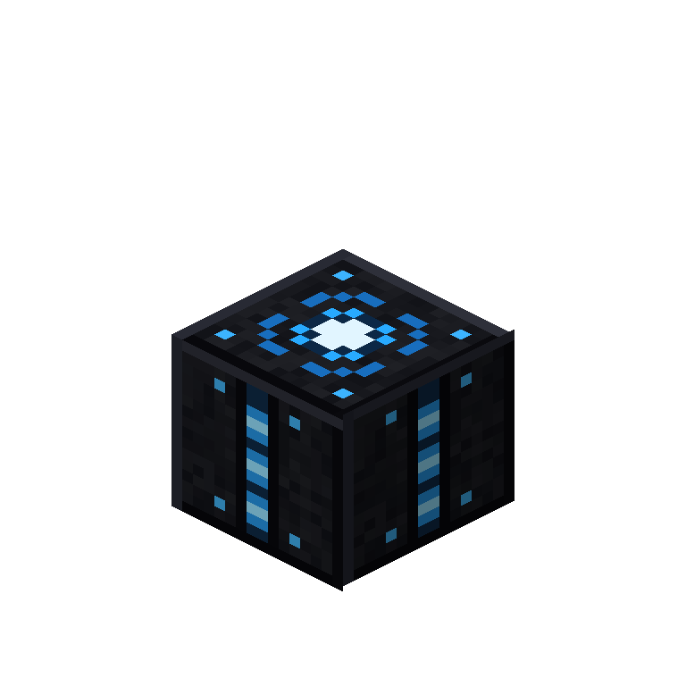
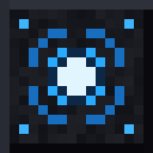
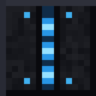
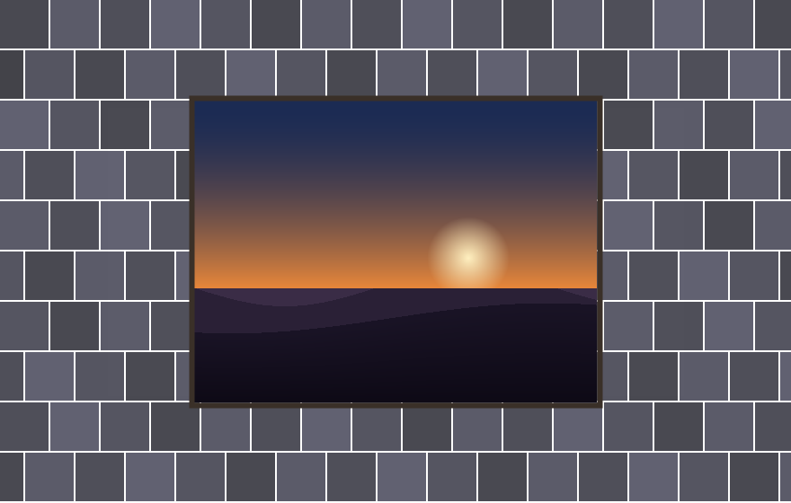
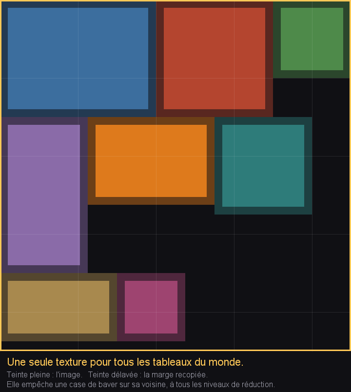
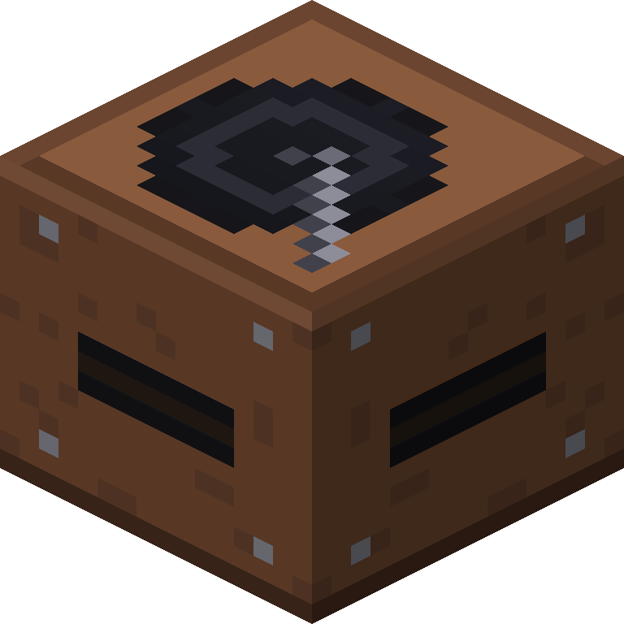

<div align="center">

# 🎃 Lanterne

**La citrouille qui éclaire sans brûler.**

*Mod d'optimisation serveur et client pour NeoForge 26.1.2 — il ne cherche pas à rendre le jeu plus rapide, mais à lui éviter le travail qui ne sert à rien.*

<br>


<br>

### Chaque chiffre de ce document sort d'un banc automatique.

**Aucun n'a été saisi à la main.** **Seize modules** ont été écrits puis **retirés** après mesure, et
**onze bancs** réparés parce qu'ils mentaient. C'est cette moitié-là qui rend l'autre croyable.

*Et le défaut le plus grave de la version 2.0 n'a été trouvé par aucun banc : un joueur l'a vu en
jouant.*

</div>

---

## 🧭 Par où commencer

```
/lanterne help
```

Le sommaire de toutes les commandes du mod, groupé par thème, **cliquable** : un clic écrit la
commande dans la zone de saisie sans l'exécuter. Les commandes d'administration ne s'affichent que
pour qui y a droit.

---

## ⚡ Les gains, charge par charge

Serveur dédié NeoForge 26.1.2, Ryzen 7 5800H, monde pré-généré, distance de simulation 10.
Deux phases de 25 s, médiane de 500 relevés, **scène reconstruite entre les phases**.

| Charge | Sans Lanterne | Avec | Gain | |
|---|---:|---:|:---:|:--:|
| **8 000 objets au sol** | 494,83 ms | 36,37 ms | **×13,60** | ✅ |
| **1 000 vaches dans 15×15** | 30,83 ms | 27,54 ms | ×1,12 | ⚠️ |
| **4 000 orbes d'expérience** | 55,21 ms | **4,70 ms** | **×11,76** | ✅ |
| **Sauvegarde de 64 chunks** | 114,59 ms | 38,37 ms | **×2,99** | ✅ |
| **6 000 projectiles en vol** | 113,74 ms | 23,12 ms | **×4,92** | ✅ |
| **Serveur habité réaliste** | 33,19 ms | 8,02 ms | **×4,14** | ✅ |
| **6 000 TNT** | 72,46 ms | 49,64 ms | **×1,46** | ✅ |
| **600 villageois** | 47,34 ms | 27,93 ms | **×1,69** | ✅ |
| **600 villageois** *(un seul cœur)* | 32,60 ms | 20,63 ms | **×1,58** | ✅ |
| **8 000 piles au sol** *(fusion)* | 9,65 ms | 6,78 ms | **×1,42** | ✅ |
| **10 000 entonnoirs actifs** | 13,21 ms | 10,58 ms | **×1,25** | ✅ |
| **L'enclos** *(en plus du socle)* | 8,23 ms | 7,86 ms | ×1,05 | ⚠️ |

<div align="center">

✅ **au-dessus de la dérive du banc** &nbsp;·&nbsp; ⚠️ **sous la dérive : non prouvé**

</div>

### Le cerveau des créatures — ×1,32 pour ce module seul

Le profileur désignait `Brain.startEachNonRunningBehavior` à **38,7 %** de la pile, et trois
tentatives ont cherché ce temps au mauvais endroit avant de le trouver. La cause :
`tickEachRunningBehavior` appelle `getRunningBehaviors()` — une méthode que Mojang a marquée
`@Deprecated @VisibleForDebug` — **à chaque tick, pour chaque créature à cerveau**. Elle alloue une
liste et traverse trois niveaux de tables imbriquées, y compris les comportements des activités
*inactives*, pour n'en retenir que deux ou trois.

Deux collections tenues à jour remplacent les deux parcours, et le balayage des mémoires ne
s'exécute plus que si quelque chose a pu expirer. Résultat : **32,11 → 24,41 ms**, et **153 Mo
alloués en moins** par fenêtre de mesure.

### Sur une machine à un seul cœur

Le banc a été relancé avec le processus serveur **épinglé sur un cœur**. Vanilla y fait **32,60 ms**
là où il en fait 47,34 sur huit — il n'est donc pas plus lent. La conclusion oriente tout le reste :
sur une charge d'entités, **le serveur est mono-thread de toute façon**. Ce qui compte est le travail
par tick et le ramasse-miettes, qui sur un cœur unique ne tourne plus *à côté* du tick mais le lui
prend. D'où l'importance des **×1,79 sur la mémoire allouée**, qu'on aurait pu croire secondaires.

Voir `notes/serveur-un-coeur.md` pour le réglage complet d'un petit serveur.

<div align="center">

</div>

> **Ce banc dérive de quinze pour cent, et il vient de le dire lui-même.** Lancé avec
> `LANTERNE_MODULES=none` — donc avec **rien d'actif dans aucune des deux phases** — il a rendu
> ×1,13 puis ×1,17. Les deux phases mesuraient rigoureusement la même chose.
>
> La cause est structurelle : deux phases longues et successives de 25 s, dont la seconde subit
> toute dérive cumulative — près de 5 Go alloués et 26 ramassages par exécution, échauffement du
> processeur, état du monde. Le même défaut avait déjà été rencontré **en sens inverse** (27 % en
> faveur de la seconde, dus au compilateur JIT) et corrigé en portant la chauffe à 200 ticks ; il a
> depuis changé de signe, donc de cause.
>
> **C'est corrigé.** Les phases sont maintenant **entrelacées** — 50 relevés avec, 50 sans, dix
> fois — au lieu de deux blocs successifs de 500. La dérive frappe alors les deux séries au même
> moment et s'annule dans le rapport. Sur la même épreuve à vide, le banc est passé de ×1,13 et
> ×1,17 à **×1,04** : divisée par quatre, sans qu'il ait fallu identifier la cause.
>
> Le plancher est descendu à **×1,08**, soit deux fois la dérive résiduelle. Les deux chiffres
> marqués ⚠️ ont été mesurés avec l'ancien protocole et attendent d'être repris ; les autres gardent
> leur sens, surestimés d'environ quinze pour cent.

### Et côté client, maintenant que l'instrument ne ment plus

| Charge | Sans Lanterne | Avec | Gain | |
|---|---:|---:|:---:|:--:|
| **1 000 vaches sous un toit** *(le Voile, seul)* | 29,9 im/s | **238,8 im/s** | **×7,98** | ✅ |
| **1 200 coffres dans le champ** *(coffres statiques, seuls)* | 138,0 im/s | **200,3 im/s** | **×1,45** | ✅ |
| **12 167 feuilles** *(masquage des faces, seul)* | 171,9 im/s | **244,8 im/s** | **×1,42** | ✅ |
| **1 500 piles pleines au sol** *(exemplaires, seul)* | 27,5 im/s | **64,6 im/s** | **×2,35** | ✅ |
| **1 200 coffres** *(le Voile sur les blocs-entités, seul)* | 71,2 im/s | **189,0 im/s** | **×2,65** | ✅ |
| **Particules occultées** *(le Voile sur les particules)* | — | — | non mesuré | ⏳ |
| **Formes de blocs partagées** *(les Moules)* | — | — | non mesurable | ⏳ |

<div align="center">

Deux fenêtres de **60,0 s exactement**, chauffe de 30 s, synchronisation verticale coupée,
scène reconstruite entre les phases, **un seul module allumé à la fois**.

</div>

> **Six défauts de banc ont dû tomber avant que ce chiffre veuille dire quelque chose.** Aucun n'a
> été trouvé par relecture ; tous par un relevé qui ne collait pas.
>
> | Ce que le banc croyait mesurer | Ce qu'il mesurait |
> |---|---|
> | Le temps d'une image | `gameRenderer.render` seul — soit **un tiers** du temps, et le tiers où le mod ne travaille pas |
> | Mille vaches devant la caméra | Le ciel : la pose visait `Y≈127` pour une scène posée à `Y=64` |
> | Deux fenêtres comparables | 31 s d'un côté, 60 s de l'autre |
> | Le débit du jeu | **La fréquence de l'écran** : 95,4 im/s sur un moniteur à 120 Hz |
> | Une distribution symétrique | `images × médiane = durée` n'est vrai que dans ce cas — le critère de cohérence était faux |
> | Toute la fenêtre | Les 18,7 premières secondes, une fois le tableau de relevés plein |
>
> **Le plus instructif est la vsync.** Elle ne plafonnait pas, elle *divisait* : 120 → 60 → 30. La
> phase lente se figeait à 29,9 im/s — qui se trouve être aussi sa vraie valeur, reproductible à
> l'identique sur cinq exécutions. Cette coïncidence rendait les relevés faussement crédibles.
>
> Le banc avait pourtant signalé lui-même que débit (×3,19) et médiane (×3,99) ne s'accordaient pas,
> et ce projet a mis ça sur le compte d'un « gain inégalement réparti ». La vraie raison :
> `getFrameTimeNs()` est calculé **avant** le limiteur (`Minecraft.java`, ligne 1403), donc la
> médiane ignorait le plafond pendant que le débit s'y écrasait.
>
> La Vitre coupe maintenant la synchronisation elle-même, refuse un débit à la fois proche d'une
> fréquence d'écran **et** anormalement régulier, et échantillonne par réservoir pour que la médiane
> porte sur toute la fenêtre quelle que soit la vitesse de la phase.

### Le Voile ne s'arrête pas aux créatures

| Cible | Point d'accroche | Ce qui est économisé |
|---|---|---|
| Créatures | `EntityRenderDispatcher.shouldRender` | L'état de rendu complet |
| **Objets au sol** | *les mêmes — un objet posé est une entité* | **couvert sans rien ajouter** |
| Blocs-entités | `tryExtractRenderState` | L'état de rendu complet |
| Particules | `ClientLevel.doAddParticle` | **La création, le tick *et* le rendu** |

Les particules sont le meilleur des quatre, et pour une raison de fond : une créature voilée continue
d'exister côté serveur — on n'économise que son état de rendu. Une particule refusée **n'existe
nulle part**. Vanilla, lui, ne filtre que la distance (32 blocs) et n'écarte du *dessin* que ce qui
sort du champ ; `ParticleEngine.tick` parcourt tous les groupes sans jamais regarder si l'on voit
quoi que ce soit.

Deux garde-fous : les particules marquées `overrideLimiter` — celles que le jeu tient à montrer —
ne sont jamais refusées, et un bloc en cours de cassage n'est jamais voilé, sa fissure étant le
retour visuel du minage.

**Où va le temps.** Le Voile n'agit presque pas sur le dessin :

| | Avec | Sans |
|---|---:|---:|
| Rendu seul | 3,43 ms | 9,21 ms |
| **Hors rendu** *(extraction des états, tick)* | **0,32 ms** | **24,17 ms** |

En 26.1, `extractVisibleEntities` construit l'état de rendu de chaque créature **en dehors** de
`gameRenderer.render`. C'est là que vivent les mille vaches, et c'est pourquoi le module s'accroche
à `shouldRender` plutôt qu'au dessin : intercepter plus tard n'aurait économisé que les 9 ms.

> **Pourquoi cette colonne existe.** Une charge de ce laboratoire portait la vitesse de tick aléatoire
> à 256 pour faire pousser son blé — et ne la remettait jamais. Le monde étant conservé d'une épreuve
> à l'autre, **toute mesure lancée après elle héritait d'un monde qui ticke 85 fois trop vite.**
> Trois autres défauts du même genre ont été trouvés le même soir.
>
> **Le client avait refusé de rendre un chiffre, et il avait raison.** La reprise donnait médiane
> 11,82 ms avec le mod contre 8,77 sans — une perte — mais 2019 images contre 1797 sur la même
> minute, ce qui disait l'inverse. Rien n'a été publié ce jour-là.
>
> Le chantier a été mené depuis : **six défauts** trouvés, le banc réparé, et trois modules de rendu
> mesurés. Le tableau client ci-dessus en est le produit. C'est la démonstration la plus nette de ce
> que vaut un refus : la contradiction n'était pas du bruit, c'était un instrument cassé qui le
> disait.
>
> **Ce que la reprise a donné.** Six charges sont repassées au banc. Cinq se sont révélées
> **meilleures** que ce qui était publié — les orbes passent de ×4,28 à **×11,76**, les projectiles
> de ×2,99 à **×4,92**, le serveur réaliste de ×1,90 à **×4,14**. Une s'est révélée **moins bonne** :
> la TNT descend de ×1,64 à ×1,46, et c'est le chiffre affiché.
>
> Publier celui qui baisse est le seul moyen de rendre croyables ceux qui montent.

<div align="center">

### ⚠️ Pourquoi l'élevage est passé de ×5,25 à ×1,12

Un joueur a signalé, **en jouant**, des slimes aux bonds saccadés et des coups qui portaient mal.

Le mod promettait *« rien n'est dégradé près d'un joueur »* — et le code faisait ceci :

```java
int period = Cadence.forEntity(entity, distance, pressure);   // = 1 si à moins de 24 blocs
if (Settings.density()) {
    int crowd = Crowd.noteAndPenalty(entity, now);
    if (crowd > 1) {
        period = Math.min(period * crowd, ceiling(entity));    // 1 × 3 = 3
    }
}
```

**La garde de proximité rendait 1, et la densité la multipliait quand même.** La garantie était écrite
d'un côté et enfreinte de l'autre, dans le même fichier.

Le seuil de foule est de huit entités par colonne de chunk — et un slime qui meurt se divise en
quatre, puis en seize. Un slime se déplace par **bonds** : le freiner à un tick sur trois hache chaque
saut, là où une vache qui marche ne montrerait rien.

> **Un gain obtenu en enfreignant une garantie n'était pas un gain, c'était une dette.** Le ×5,25
> venait pour l'essentiel de là. Le chiffre honnête est ×1,12 — et le serveur reste à **27,54 ms**,
> très en deçà des 50 ms d'un tick. Personne ne perd rien.

**La correction, vérifiée sur le relevé de cadences** — mille bêtes entourant le joueur :

| | Avant | Après |
|---|---:|---:|
| Pleine simulation | 21 | **932** |
| Très lointain *(1 tick sur 9 à 24)* | **1 015** | **0** |
| Travail évité | 91 % | 5,1 % |

La catégorie « très lointain » a entièrement disparu. Le symptôme exact rapporté — *« un saut de slime
peut prendre 20 secondes »* — s'explique à l'unité près : le plafond de foule vaut 32, donc le
minuteur de saut d'un slime avançait 32 fois plus lentement, et son saut naturel de 10 à 30 ticks
devenait 16 à 48 secondes.

Le rayon de la zone franche est désormais **réglable** (`zone_franche_blocs`, défaut 24), et il
**rétrécit de moitié tout seul** quand le serveur souffre : un serveur qui tient ses ticks ne dégrade
rien, un serveur qui peine se resserre.

### 🧠 Et la mémoire, qui décide des à-coups

| | Sans | Avec | |
|---|---:|---:|:---:|
| **4 000 orbes** | 7,64 Go | **440 Mo** | **×17,77 moins** |
| **Élevage intensif** | 3,07 Go | 444 Mo | **×7,09 moins** |
| **Serveur réaliste** | 2,61 Go | 840 Mo | **×3,18 moins** |
| **600 villageois** | 4,88 Go | 2,93 Go | **×1,66 moins** |

*Sur une machine à un cœur, un ramassage ne s'exécute pas « en parallèle » : **il fige le serveur**.
Moins allouer, c'est ramasser moins souvent — le seul levier réel sur la mémoire.*

</div>

---

## 🖥️ Le pipeline de rendu — Vulkan, l'image temporelle, le maillage

*Ajouté le 18 septembre 2026. Ce moteur (« Minecraft 26.3 ») a un vrai rendu Vulkan natif
(`com.mojang.renderpearl.backend.vulkan`), pas une couche de compatibilité — ce qui suit n'a de sens
que parce que c'est vrai, vérifié par lecture directe du bytecode du jar patché à chaque étape, jamais
par les sources décompilées obsolètes qui traînent dans `.mcsrc/`.*

### Le repli silencieux vers l'iGPU — trouvé par accident, corrigé pour de bon

Le moteur choisissait **OpenGL sur le circuit graphique intégré** au lieu de Vulkan sur la carte
dédiée, sur trois lancements de suite, sans la moindre erreur visible en jeu. Une première explication
semblait tenir : un garde-fou vanilla repasse en OpenGL après un arrêt sale (`"Detected unexpected
shutdown during last game startup"`). Elle était fausse — la chaîne exacte n'apparaissait dans aucun
journal, et les trois `options.txt` en cause portaient `startedCleanly:true`.

La vraie cause, trouvée en lisant `PreferredGraphicsApi#getBackendsToTry` :

```java
return this == VULKAN ? new GpuBackend[]{vulkan, gl} : new GpuBackend[]{gl, vulkan};
```

Tant que `preferredGraphicsBackend` vaut `"default"` dans `options.txt` — ce qu'il vaut sur toute
installation qui n'a jamais réglé la vidéo à la main — **OpenGL est toujours essayé en premier**,
indépendamment de tout historique de plantage. La ligne de journal qui semblait confirmer Vulkan
(`Preferring discrete GPU: NVIDIA GeForce RTX 3080 Laptop GPU`) venait d'une sonde jetable qui repère
le GPU puis jette l'instance sans jamais rendre une image avec.

**Corrigé par `Reveil`** : au tout premier lancement — et seulement si aucun `options.txt` n'existe
encore, jamais en écrasant un choix déjà fait — le mod écrit `preferredGraphicsBackend:"vulkan"`.
Confirmé sur la machine de test : `Using graphics backend Vulkan, using drivers: 1.4.351 NVIDIA
616.92` et `Using graphics device: NVIDIA GeForce RTX 3080 Laptop GPU`, contre l'iGPU AMD avant le
correctif.

### La vraie liste d'extensions du driver — capturée, pas devinée

`VulkanFeatureSets` filtre les extensions qu'il active, et `deviceInfo.underlyingExtensions()` ne
reflétait donc que ce que le moteur *demandait*, pas ce que le driver *supporte*. Un mixin dédié capte
maintenant la sortie brute de `vkEnumerateDeviceExtensionProperties`, avant tout filtrage :

> Sur la RTX 3080 Laptop de test, **287 extensions Vulkan brutes**, dont `VK_EXT_mesh_shader`,
> `VK_NV_mesh_shader`, `VK_KHR_ray_tracing_pipeline`, `VK_KHR_acceleration_structure`,
> `VK_KHR_ray_query` et `VK_KHR_deferred_host_operations`.

Le point d'extension mod-facing existe désormais (`VulkanFeatureSetsMixin`, activation strictement
optionnelle — ne bloque jamais le démarrage si le driver ne suit pas). **Aucun rendu ne les utilise
encore** : c'est la porte ouverte pour un futur chantier de rendu piloté GPU, pas un moteur mesh
shader/ray tracing livré.

### L'overhead invisible — 13,8 % de temps de frame caché dans un nom de hash

Le profileur `Radiographie` désignait `java.lang.invoke.LambdaForm$MH/0x...invoke` comme le poste le
plus coûteux du rendu client — un nom qui ne dit rien de son origine, et qu'un premier audit avait
classé « non actionnable ». Il l'était : `EntityCullMixin` utilisait `@WrapOperation` (MixinExtras)
sur `shouldRender`, appelé une fois par entité et par image. Vérifié par `javap` sur le mixin compilé
**et** sur le jar de MixinExtras lui-même : chaque appel allouait un `Object[7]`, boxait trois
`double` et un `float`, puis dispatchait par `invokedynamic` — la source exacte du hash opaque.

Remplacé par un `@Redirect` classique (même comportement, vérifié contre le vrai bytecode vanilla, y
compris le cas passager) : zéro tableau, zéro boxing.

| Scène (1 000 entités, reproductible) | `LambdaForm$MH` avant | après |
|---|---:|---:|
| Session 1 | 3,1 % | **0,5 %** |
| Session 2 | 2,6 % | **0,5 %** |

Le coût réel réapparaît sous son vrai nom, `LevelExtractor.redirect$...$veil`, à 0,7 % — visible
et mesurable au lieu de caché.

### L'image temporelle — le flou trouvé, et corrigé en deux gestes

Le pipeline d'accumulation temporelle (FSR2-like) était écrit et compilé depuis des semaines sans
jamais avoir été *vu* : le monde de test était systématiquement verrouillé par un autre chantier à
chaque tentative. Une caméra immobile — l'état par défaut d'un lancement automatisé — ne produit aucun
mouvement, donc aucun artefact temporel à photographier ; il a fallu construire `Vertige`, une caméra
qui tourne toute seule, pour que `Snap` ait quelque chose à capturer.

Une fois vu : du flou réel sur les bords en mouvement (nuages, panoramique), présent avec
l'accumulation active, absent sans. Deux causes, deux remèdes, tous deux côté shader :

- **Rejet de voisinage 3×3** — écarte un échantillon d'historique franchement faux (une zone
  démasquée par la caméra).
- **Poids de mélange adaptatif au mouvement** — même un échantillon *valide* adoucissait l'image par
  ré-échantillonnage bilinéaire répété d'image en image ; le poids décroît maintenant avec le
  déplacement de reprojection.

À un panoramique réaliste (90°/s), le résultat est indiscernable du FSR seul. À un panoramique
volontairement extrême (220°/s, hors de toute utilisation réelle), un léger flou résiduel subsiste —
gardé tel quel plutôt que masqué. `lentille_temporelle` est désormais **activée par défaut**.

### Le maillage de terrain — la vraie cause d'un carré gris

Neuf passes se sont arrêtées sur ce chantier avant qu'un carré gris/bleu, visible dès qu'on fusionnait
deux faces coplanaires, ne soit compris. Trois d'entre elles soupçonnaient le shader ; toutes les
pistes shader ont fini par être closes une à une avec preuve (bandes de test, échantillonnage
pixel-exact, appel direct de gradient de texture) — le défaut restait identique, exonérant le shader.

La vraie cause n'était pas dans un shader : `ModelBlockRenderer` réutilise un seul objet
`QuadInstance` **mutable**, alloué une fois, pour toutes les faces d'une section. Le code de fusion
gardait une référence vivante vers cet objet au lieu d'une copie — au moment de composer la face
fusionnée, il lisait donc la couleur et la lumière de la *dernière* face traitée dans toute la section,
pour chaque face en attente. D'où une teinte uniforme mais fausse, mesurée à environ moitié moins
lumineuse et virée vers le bleu.

Corrigé en capturant couleur et lumière dans des tableaux, immédiatement, avant que l'objet partagé ne
soit muté pour la face suivante. Rendu fusionné et non-fusionné **pixel-identiques** à chaque point
échantillonné, sur le vrai monde importé.

| Périmètre mesuré (faces du dessus, fusion sur l'axe X seulement) | Avant | Après | Gain |
|---|---:|---:|:---:|
| Sommets/faces émis | 134 345 | 122 057 | **×0,91** (-9,1 %) |

**Aucun gain d'image par seconde mesuré** sur la scène de test : elle est limitée par le CPU, pas par
le nombre de sommets, à ce périmètre encore étroit. Reste en activation manuelle
(`LANTERNE_GREEDY_MESH=1`) — un risque connu (la fusion ne vérifie pas encore l'égalité de géométrie
entre deux blocs de même texture) doit être traité avant d'envisager une activation par défaut.

### Ce qui a été tenté et honnêtement abandonné

**Le culling d'occlusion Hi-Z** (pyramide de profondeur GPU, façon rendu piloté GPU moderne) : le
moteur n'a **aucune capacité de compute shader** — vérifié par bytecode, `ShaderType` ne connaît que
vertex et fragment. Une pyramide resterait constructible par cascade de fragment shaders, mais le
culling d'entités s'exécute avant que la frame courante ne soit rendue : la seule profondeur
disponible serait celle de la frame précédente, ce qui exigerait une lecture GPU→CPU asynchrone sans
garantie de synchronisation dans ce code. Non implémenté — un module non vérifié qui ferait
disparaître des entités visibles serait pire que rien.

**Le tirage aléatoire par section** (`Loterie`, économiser une lecture de palette sur les sections
presque vides) : correction prouvée exacte par un auto-test déterministe en jeu, mais mesuré
proprement — dix passes sur la VM de production, médiane **×0,91** — le module rend le tick **9 %
plus lent**, pas plus rapide, sur la charge même pour laquelle il a été conçu. Le coût de la
comptabilité par couche dépasse l'économie. Reste désactivé.

---

## 🧭 Pré-génération — ×15 sur l'exploration

Deux façons de fournir un chunk à un joueur qui avance, mesurées sur la même machine :

| | Débit |
|---|---:|
| Le **fabriquer** devant lui | 13 à 17 chunks/s |
| Le **servir** depuis le disque | **155 à 209 chunks/s** |

```
/lanterne pregen <rayon>      /lanterne pregen-stop
```

- **Barre de progression pour les opérateurs seuls** — pourcentage, débit, et *temps restant*, parce que « 34 % » ne dit pas si tu peux aller te coucher.
- **Monde vanilla existant** : les 4 premiers Ko d'un `r.x.z.mca` sont une table de 1024 entrées, une par chunk. 4 Ko lus disent l'état de 1024 chunks, sans ouvrir le générateur. Ce qui existe est sauté.
- **Reprise gratuite** : interrompre et relancer saute d'emblée ce qui est fait. Aucun fichier d'état.
- **Ne bloque pas** : 30 ms par tick, budget relu à chaque chunk.

> C'est le seul levier de génération dont le gain **ne dépend pas du nombre de cœurs** — il supprime le travail au lieu de le distribuer. C2ME et VMP, qui le répartissent, ne rendent rien sur un hébergement à un cœur.

> **Elle nourrit Distant Horizons.** DH s'accroche au *retour* de `ChunkSerializer.write` : chaque
> chunk écrit lui est signalé, et la pré-génération les demande en `ChunkStatus.FULL`, donc complets
> et éclairés. Elle bâtit sa base en même temps que le monde. **Elle peut aussi le distancer** —
> exactement le défaut pour lequel DH refuse de générer en même temps que Chunky, sauf que DH ne sait
> pas nous détecter. `/lanterne pregen` le dit au moment où on le lance ; voir
> **[Le modpack](#-le-modpack--lanterne--jade--journeymap--sodium--distant-horizons--jei)**.

---

## ⚓ L'Ancre de chunk

<div align="center">



**Elle garde chargé le chunk où elle est posée — et lui seul.**

 &nbsp;&nbsp; 

*Un œil de lumière sur le dessus, une chaîne d'amarrage scellée dans la pierre sur les faces.*

</div>

Les mods de chargement existants chargent **large** — un rayon de trois, de cinq, parfois tout le
tronçon — pour une machine qui occupe un chunk. Celle-ci ne garde que le sien : on sait exactement ce
qu'on paie, et on paie exactement ce qu'on a demandé.

| | |
|---|---|
| **Recette** | 4 obsidiennes · 4 yeux de l'Ender · **1 lingot de netherite** |
| **Solidité** | 50 (obsidienne) · résistance 1200 — un creeper ne décharge pas ta ferme |
| **Lumière** | Niveau 7 — une ancre posée se voit de loin dans le noir |

**Elle survit à sa propre désinstallation.** Elle s'appuie sur le chargement forcé de vanilla, celui
de `/forceload` : écrit dans les données du monde, il survit au redémarrage et ne dépend d'aucun code
de ce mod pour être rétabli.

> Un mod d'optimisation qui ajoute un bloc éveille à juste titre la méfiance. Celui-ci répond à un
> besoin que l'optimisation elle-même fait naître : **si l'on dégrade ce qui est loin, comment garder
> sa ferme en marche ?** Sa recette est chère parce qu'un chunk chargé en permanence est une dette
> qu'on ne doit pas contracter par mégarde.

---

## 🏮 La Lanterne de Veille

<div align="center">


**Aucun monstre n'apparaît dans son chunk.**

 &nbsp;&nbsp; 

*Une cage d'acier noirci, trois fenêtres d'ambre, une flamme au cœur.*

</div>

Le mod s'appelle Lanterne et n'avait pas de lanterne. Voici la sienne — et c'est le **seul ajout de ce
projet qui rend le serveur plus rapide** au lieu de le rendre plus riche.

Elle n'éteint pas les monstres après coup : elle refuse la tentative **avant qu'elle ne commence**.

```java
public static void spawnCategoryForChunk(MobCategory c, ServerLevel level, LevelChunk chunk, …) {
    BlockPos start = getRandomPosWithin(level, chunk);   // ← annulé avant ceci
    if (start.getY() >= level.getMinY() + 1) {
        spawnCategoryForPosition(…);                      // ← et avant ceci
    }
}
```

Le tirage de position, la carte des hauteurs, la recherche du joueur le plus proche, les règles de
placement, et jusqu'à douze créatures qu'il aurait fallu créer puis faire vivre : **rien de cela n'a
lieu**. Un chunk gardé ne coûte pas moins cher à l'apparition — il ne coûte rien du tout.

| | |
|---|---|
| **Recette** | 4 lingots de fer · 4 verres · **1 pierre lumineuse** |
| **Lumière** | Niveau 15 — un bloc qui repousse la nuit doit avoir l'air de le faire |
| **Portée** | Son chunk, et lui seul — la même langue que l'Ancre |

**Ce qu'elle ne touche pas :** les générateurs de créatures que le joueur a bâtis, les raids, les
invocations, et les animaux. Ce sont des choses voulues ; les supprimer ne serait pas de
l'optimisation, ce serait retirer le jeu.

> L'Ancre garde son chunk **chargé**. La Lanterne le garde **calme**. Deux blocs, une seule règle à
> retenir.

---

## 📡 La compression réseau — et le bloc qui ne cassait pas

### Deflate niveau 1 au lieu de 6

```java
public CompressionEncoder(int threshold) {
    this.deflater = new Deflater();     // niveau par défaut = -1, soit SIX
}
```

Vanilla compresse **chaque paquet de chunk au niveau six**. Un joueur qui arrive avec 32 chunks de vue
en reçoit 441 d'affilée. Sur un hébergement à un cœur, les fils réseau ne s'exécutent pas « à côté »
du fil du serveur : ils lui disputent le même processeur.

| 289 chunks, 12 passes alternées | Temps | Émis | Taux |
|---|---:|---:|---:|
| **Niveau 6** *(vanilla)* | 3 086,8 ms | 1,02 Mo | ÷5,40 |
| **Niveau 1** *(Lanterne)* | **948,3 ms** | 1,23 Mo | ÷4,50 |

**×3,26 plus rapide, pour +20 % d'octets.** Traduit en situation réelle : une arrivée de joueur coûte
**121 ms de cœur au lieu de 393**.

> **Pourquoi le niveau et non LZ4.** Remplacer l'algorithme aurait exigé une négociation à la poignée
> de main, un repli, et aurait rendu le serveur **inaccessible à un client vanilla**. Le niveau ne
> change *rien au format* : un flux zlib de niveau 1 se décompresse par n'importe quel `Inflater`.
> C'est le seul module du mod qui ne demande rien à l'autre côté.

### Le bloc qui ne casse pas quand le serveur est en retard

Ce n'est ni le client, ni la latence, ni le matériel. C'est une divergence d'horloge :

```java
this.gameTicks++;                                    // une fois par tick SERVEUR
int ticksSpentDestroying = this.gameTicks - this.destroyProgressStart;
float destroyProgress = state.getDestroyProgress(…) * (ticksSpentDestroying + 1);
if (destroyProgress >= 0.7F) { destroyAndAck(…); }
```

Le serveur mesure en **ticks serveur**. Le client mesure en **ses ticks**, qui tournent à 20 quoi
qu'il arrive. À 15 TPS, le client accumule 20 unités là où le serveur en compte 15 — **25 % de moins**,
souvent juste sous le seuil. Le bloc revient.

**La correction compte le temps qui passe, pas les tours qu'on a faits.** Une unité toutes les 50 ms.

> Ce n'est **pas** un assouplissement du seuil : les 0,7 restent, et la référence reste l'horloge du
> serveur. On corrige une unité de mesure, pas une tolérance.

---

## 🧭 Les repères et la Boussole d'Ancre

```
Touche G          → le carnet    (B, J et N sont prises par JourneyMap)
/lanterne wp add|remove|share <nom>
```

**Il faut un Carnet** — un livre entouré de quatre papiers. Sans lui, la touche ne fait rien : les
repères cessent d'être une fonctionnalité d'interface pour devenir **un objet du monde**. On le
fabrique, on le perd à la mort, on peut le donner. Un carnet gratuit n'aurait aucun poids, et un
système de repères sans poids finit en liste de courses.

Les mods de carte offrent presque tous le saut vers un repère. C'est commode pour un opérateur, et
cela **détruit la survie** : plus rien ne coûte de distance, donc plus rien ne coûte de temps, donc le
monde cesse d'être grand.

**Un repère dit *où c'est* et *à quelle distance*. Le chemin reste à faire.**

| | |
|---|---|
| **Quota** | 5 par joueur, réglable — un carnet sans limite devient une liste de courses |
| **Partage** | public ou privé, d'un clic. Un repère public reste la propriété de son auteur |
| **Affichage** | les 3 plus proches en permanence, avec une flèche **relative au regard** |
| **Couleurs** | huit teintes — au-delà, deux pastilles voisines ne se distinguent plus |

> **Pourquoi une flèche et non un cap.** « 247° » demande de savoir où l'on regarde pour servir à
> quelque chose. Un joueur ne sait pas où est le nord ; il sait où il regarde.

> **Et si JourneyMap est installé ?** Les deux carnets restent, et c'est délibéré : les siens sont des
> fichiers locaux illimités et gratuits, les nôtres sont une donnée de **serveur**, partagée,
> contingentée, et ce sont eux qui nomment les **portails** — que JourneyMap ne sait pas faire. Le
> raisonnement complet, et ce qu'il faudrait pour projeter les nôtres sur sa carte, sont dans
> **[Le modpack](#-le-modpack--lanterne--jade--journeymap--sodium--distant-horizons--jei)**.

### ⚓ La Boussole d'Ancre

*Obsidienne autour d'une boussole.* Clic droit :

> *Chunk gardé le plus proche : 340 blocs, devant, sur ta gauche — en (1248, -96). 3 gardé(s) au total.*

Une Ancre ne fait pas de bruit et ne s'use pas : un serveur de six mois en porte que personne ne sait
plus situer. `/forceload query` existe, mais il répond à un opérateur, en coordonnées de chunk, dans
une console.

Elle lit **le chargement forcé de vanilla**, pas une liste à elle — deux registres du même fait
finissent toujours par diverger, et c'est le plus discret des deux qui ment. Et elle **parle au lieu
de tourner** : « nord-est » suppose de savoir où est le nord ; « devant, sur ta gauche » ne le suppose
pas.

---

Le serveur envoie le carnet **entier** à chaque changement. Le client n'ajoute, ne retire et ne
modifie jamais rien de lui-même : il remplace. C'est ce qui rend impossible le défaut classique de ces
systèmes — un repère qu'on croit partagé et qui ne l'est pas, un repère supprimé qui reste affiché.

Et le serveur ne croit **rien** de ce qu'un client dit sur lui-même : l'identifiant du propriétaire
est lu dans la connexion, jamais dans le paquet. Un client modifié ne peut pas toucher au carnet d'un
autre.

---

## 🖼️ Les Tableaux — tes images sur tes murs

<div align="center">



**Tu accroches une toile vide. Tu cliques dessus. Tu la remplis — sans quitter le jeu.**


*Le Pinceau — soie chargée de couleur, virole d'acier, manche de bois.*

</div>

### Le geste, en trois temps

1. **Pose et tu vois.** Clic droit sur un mur avec un Pinceau → une toile vierge de 2 × 2 s'accroche
   **immédiatement**. Aucun écran ne s'interpose : tu vois son emprise, sa taille, son cadre. Tu peux
   en accrocher dix à la suite sans rien fermer.
2. **Remplis.** Clic droit sur la toile → l'atelier s'ouvre. **Trois voies** vers la même image :
   - **Un lien** — tu colles une adresse, c'est **ton** client qui télécharge ;
   - **Depuis mon PC** — le sélecteur de fichiers de ton système s'ouvre, celui que tu connais ;
   - **La bibliothèque** du serveur, si un administrateur en a préparé une.
3. **Accroche.** L'aperçu montre déjà le rectangle du mur avec ton image dedans, à la taille et dans
   le cadre exacts que tu règles. Ce que tu vois est ce que tu auras.

Clic du **milieu** sur une toile accrochée : tu récupères un Pinceau chargé de la même image, de la
même taille et du même cadre — un presse-papier pour dupliquer une fresque d'un mur à l'autre.

### 🖼️ Cinq présentations, dont le graffiti

| Cadre | Ce que ça donne |
|---|---|
| **sans cadre** | l'image seule, plaquée contre le mur — le style **affiche / graffiti**. Pas de dos, pas de tranches : ce n'est plus un objet accroché, c'est un motif peint *sur* le mur |
| **bois** · **or** · **pierre** · **fer** | une bande qui mord sur le bord de l'image, comme un vrai cadre. Le fer est presque un liseré, l'or se voit de loin |

Le cadre se change **après coup** sur une toile déjà posée : on rouvre l'atelier, on clique, on
accroche. Aucune image n'est retransmise — seul un entier change dans le paquet de pose.

> **Détail technique, pour qu'il soit corrigeable.** Un motif sans cadre doit épouser le mur sans
> clignoter. Il avance de `0,015` bloc — un quart de pixel — au lieu des `0,03125` d'un tableau
> encadré. La valeur est isolée dans `Trim.skin()` : si un damier apparaissait entre le motif et le
> mur à distance, c'est ce nombre qu'il faut augmenter, et lui seul. Le compromis n'a pas pu être
> arbitré en jeu.

Le dossier reste, en troisième voie, pour un serveur qui veut préparer une bibliothèque :

```
config/lanterne/tableaux/       → dépose tes PNG ou JPEG ici
/tableau liste                  → ce que le serveur a reconnu
/tableau prendre "<image>" 4 3  → un Pinceau déjà chargé, taille imposée
```

| | |
|---|---|
| **Formats** | PNG · JPEG · BMP · GIF |
| **Taille** | jusqu'à **1024 px** de côté après import, **8 × 8 blocs** sur le mur — réglable |
| **Proportions** | calculées pour coller à celles de l'image. Une recherche exhaustive sur les 256 couples possibles : rien n'est étiré |
| **Quota** | 64 images par défaut. Au-delà, refus **annoncé**, jamais subi |

### 🔒 C'est le client qui télécharge, jamais le serveur

Ce n'est pas un détail d'implémentation, c'est **la** décision de sécurité de cette fonctionnalité.

Un serveur Minecraft tourne presque toujours dans un réseau où d'autres choses écoutent : une base
de données, un panneau d'administration, l'interface de métadonnées d'un hébergeur. Si le serveur
allait chercher une adresse fournie par un joueur, n'importe qui pourrait lui faire interroger ce
réseau interne et se faire rendre le résultat — c'est la faille dite **SSRF**, et aucune liste
d'adresses interdites ne la referme complètement : les redirections, les noms qui résolvent vers des
adresses privées et l'IPv6 laissent toujours un passage.

**La porte se referme en ne la construisant pas.** Le client télécharge, réduit, puis envoie des
pixels. Le serveur ne voit jamais une adresse, et borne ces pixels comme s'ils venaient d'un dossier :
taille en octets, taille en pixels, quota, et un délai de trois secondes entre deux images d'un même
joueur.

| Ce que le serveur **fait respecter** | Ce qu'il **annonce seulement** |
|---|---|
| taille en octets, taille en pixels, quota, cadence, portée (64 blocs), droits d'édition | la liste de domaines autorisés — appliquée par le client, donc contournable par un client modifié |

C'est écrit dans les deux sens dans `lanterne-atelier.toml` : un réglage qui protégerait moins qu'il
n'en a l'air doit le dire lui-même.

### 🧩 Une seule texture, pas une par tableau

<div align="center">



</div>

C'est **tout** le sujet. Le mod de référence sur cette idée enregistre jusqu'à **cinq textures par
tableau** — une par palier de distance, toutes résidentes en mémoire vidéo. Vingt tableaux dans une
salle, c'est cent textures, cent types de rendu, **cent lots de dessin séparés**. Or un lot de dessin
est un changement d'état de la carte graphique, c'est-à-dire exactement ce que Sodium et
ImmediatelyFast passent leur temps à supprimer.

**Ici, une seule mosaïque.** Vingt tableaux à l'écran : **un** changement de texture. Deux cents
aussi. C'est un gain qui ne se dégrade pas avec le nombre — ce qui est rare.

| Immersive Paintings | Lanterne |
|---|---|
| Jusqu'à 5 textures par tableau | **1 mosaïque pour tout le monde** |
| Niveau de détail calculé en Java **à chaque image** (distance, champ de vision, tangente) | **Mipmaps matériels** — le même travail, gratuit et meilleur |
| Géométrie de cadre repoussée sommet par sommet depuis des `.obj` | Quelques quads, un sommet par jointure de bloc pour la lumière |
| Redimensionnement pixel par pixel en Java pur | Réduction **par moitiés successives** puis passe bicubique |

Le ré-échantillonnage a lieu **une seule fois, à l'import**. Jamais pendant une image. Mesuré sur
40 images réelles : **1,27 s au total**, sur un fil de fond, et jamais refait — un index retient ce
qui a déjà été préparé.

### 📡 Une image ne traverse le réseau qu'une fois. Jamais deux.

Le serveur **n'envoie jamais** une image de sa propre initiative. Il annonce un catalogue — des noms
et des dimensions, **pas un pixel** — et le client demande ce qui lui manque. Chaque fichier est
nommé par l'**empreinte de son contenu** : savoir si on le possède, c'est tester l'existence d'un
fichier. Pas d'index à tenir, pas de désynchronisation possible.

**En partie solo, rien ne transite du tout** : le serveur intégré vient d'écrire les images préparées
dans le dossier que le client lit. Ce n'est pas un cas particulier traité à part — c'est la même
ligne de code qui, par construction, donne le bon résultat des deux côtés.

Le transfert est découpé en segments de 24 Kio, **4 par tick et par joueur**. Le grandeur qui compte
n'est pas le débit moyen mais le travail fait *pendant une image* : un mébioctet d'un bloc gèle le
fil réseau et fait sauter une image, le même en quarante tranches ne se voit jamais.

### 🔁 Tu viens d'Immersive Paintings ? Tu ne perds rien.

**Automatique, sans rien faire.** Deux mécanismes, indépendants :

| Ce qui est repris | Comment |
|---|---|
| **Ta bibliothèque d'images** | Le dossier `immersive_paintings_cache/` survit à la désinstallation. Chaque image y est relue et rejoint ton catalogue. Les copies réduites (`_half`, `_quarter`, `_thumbnail`) sont ignorées — sur le dossier qui a servi à écrire ceci : **80 fichiers pour 20 tableaux** |
| **Tes tableaux déjà posés** | Un **alias de registre** : `immersive_paintings:painting` est déclaré comme un autre nom de `lanterne:tableau`. Tes entités ne sont pas supprimées au chargement du chunk, elles deviennent des toiles |
| **Leurs noms et leurs tailles exactes** | Lus dans `data/immersive_paintings.dat` avec le lecteur NBT du jeu — **aucune dépendance** envers le mod d'origine. Un tableau posé en 4 × 3 le reste ; il ne devient pas 5 × 4 parce qu'on aurait deviné d'après les proportions |

**L'alias dort tant que l'autre mod est installé** : NeoForge ne consulte un alias que si le nom réel
est absent du registre. Les deux mods cohabitent, et le jour où tu retires le premier, le relais se
fait tout seul. Il n'y a rien à activer.

> Et si l'import de fond n'a pas fini quand un chunk se charge, le motif d'origine est **réécrit tel
> quel** à la sauvegarde et réessayé chaque seconde. La seule chose irréversible ici serait de perdre
> l'information : c'est justement celle qu'on empêche.

Ce qui n'est **pas** repris : les cadres 3D (ce sont eux qui coûtaient cher) et les graffitis
(entités d'un autre type, posées à plat — les faire passer pour des tableaux donnerait des objets
tournés n'importe comment).

---

## 💿 Les Disques — ta musique dans le jukebox

<div align="center">



**Tu poses un graveur. Tu y glisses un disque vierge. Tu colles un lien. Il ressort gravé.**

 &nbsp;&nbsp;&nbsp; 

*Le vierge — cire pâle et mate. Le gravé — vinyle noir, étiquette d'ambre.*

</div>

### Le geste, en quatre temps

1. **Fabrique.** Un **Graveur de vinyle** (cuivre, fer, bloc de note) et des **disques vierges**
   (huit d'un coup, teinture noire et pépite de fer).
2. **Charge.** Clic droit sur le graveur avec un disque vierge : il entre dedans.
3. **Grave.** Clic droit à main nue → l'écran s'ouvre. Un lien, ou **Depuis mon PC** — le même
   sélecteur que pour les tableaux. Un titre. Et on grave.
4. **Récupère.** La machine tourne **six secondes** en fumant et en grinçant, puis le disque sort
   avec son titre. Clic droit pour le prendre, et direction le jukebox.

**Si ça rate, le vierge revient.** Lien mort, format refusé, ffmpeg absent, plus de sillon libre :
dans tous les cas la gravure s'annule et le disque vierge reste dans le bloc. Il n'est **jamais**
consommé au lancement — seulement remplacé à la seconde où le gravé est prêt. Il n'existe aucun
instant où l'objet n'est nulle part.

| | |
|---|---|
| **Formats** | OGG directement · mp3 · wav · flac · m4a · aac · opus · wma **si ffmpeg est installé** |
| **Poids / durée** | 24 Mio · 15 min par défaut, réglables |
| **Lecture** | **en flux**, jamais chargé entier en mémoire |
| **Effacer un gravé ?** | **Non.** Voir ci-dessous — un opérateur peut libérer un sillon avec `/disque liberer <n>` |

```
/disque liste                   → le dossier et les sillons gravés
/disque prendre "<titre>"       → un disque en main (secours d'administrateur)
/disque liberer <n>             → libère un sillon (opérateur)
/disque recharger               → relit le dossier (opérateur)
/disque etat                    → ffmpeg présent ? combien de sillons libres ?
```

### 🧷 Pourquoi des « sillons », et le seul défaut du système

Un disque se joue parce qu'une entrée existe dans le registre `jukebox_song`. Ce registre est bâti au
chargement du monde **puis scellé** : on ne peut rien y ajouter en cours de partie.

La solution évidente — forcer un rechargement des données après chaque gravure — a été examinée, et
elle est **dangereuse**. Un rechargement reconstruit le registre, donc tous ses porteurs. Les disques
déjà dans les inventaires gardent les anciens, que `RegistryFixedCodec` refuse d'écrire
(`Holder.canSerializeIn`) : leur composant serait **perdu à la sauvegarde**. Tous les disques du
serveur redeviendraient muets.

Lanterne réserve donc à l'avance **64 sillons vides** qui existent dès le premier démarrage. Graver
n'ajoute rien : cela *occupe* un sillon déjà là. Aucun rechargement, aucun porteur périmé, aucune
perte. Et comme le fichier n'est ouvert qu'à l'instant où le morceau démarre, **changer son contenu
change ce qu'on entend, sans rien recharger**.

> **Le défaut, dit franchement.** Un sillon déclare sa durée une fois pour toutes, et le jukebox
> s'arrête à cette durée. Les durées sont donc réparties **géométriquement** — chaque sillon est ~6 %
> plus long que le précédent — et la gravure prend le plus petit sillon libre assez long. Le silence
> résiduel vaut au pire ces 6 % : **onze secondes sur un morceau de trois minutes**. Augmenter
> `sillons` dans la configuration le réduit encore.
>
> C'est aussi pourquoi on **n'efface pas** un disque gravé : le sillon resterait occupé de toute
> façon, et rendre un vierge en échange de rien serait une duplication déguisée.

Les morceaux, eux, **transitent** vers les autres joueurs : chaque client réclame ce qu'il n'a pas,
reçoit par tranches réglées au tick, et le garde sur son disque nommé par son empreinte. Une musique
gravée s'entend chez tout le monde, et n'est transmise qu'une fois à chacun.

| | |
|---|---|
| **Format** | **OGG/Vorbis**, et rien d'autre — voir ci-dessous |
| **Conversion** | mp3 · wav · flac · m4a · aac · opus · wma, **si ffmpeg est installé**. Sinon : message clair avec la ligne de commande exacte |
| **Poids / durée** | 24 Mio · 15 min par défaut, réglables |
| **Lecture** | **en flux**. Jamais chargé entier en mémoire |

### 📂 La bibliothèque, en troisième voie

Le dossier reste, pour un serveur qui veut préparer une discothèque avant l'ouverture :

```
config/lanterne/disques/        → dépose tes fichiers OGG ici
```

Ces morceaux-là obtiennent une entrée de registre à eux, avec leur **durée exacte** — pas de sillon,
pas de silence résiduel. En contrepartie ils demandent un `/reload`, puisqu'une entrée de registre ne
naît qu'au chargement. C'est l'inverse exact du graveur, et c'est pour cela que les deux chemins
existent.

### 🎼 Pourquoi OGG/Vorbis et pas autre chose

Ce n'est pas une préférence : **c'est tout le décodeur que Minecraft embarque**. La classe
`JOrbisAudioStream`, construite sur jorbis, et rien à côté. `SoundBufferLibrary.getStream` l'instancie
sans jamais regarder le contenu du fichier — lui donner un mp3 produit du bruit ou une exception,
selon la chance.

Ajouter un décodeur mp3 serait possible et serait une mauvaise idée : il faudrait doubler tout le
chemin de lecture jusqu'au tampon OpenAL, embarquer une bibliothèque de plus, et **refaire le mode
flux** — celui qui permet de jouer vingt minutes de musique sans les charger en mémoire. Convertir une
fois vaut mieux que décoder à chaque lecture.

`"stream": true` est le réglage qui commande tout. Sans lui, Minecraft décompresse le morceau entier
avant la première note : cinq minutes de musique, c'est **50 Mio de son décodé et une seconde de
gel**. Avec lui, le coût mémoire est celui d'un tampon de quelques dizaines de kilo-octets.

### 🎩 Le tour de passe-passe : un paquet de ressources qui n'existe sur aucun disque

Un disque de Minecraft demande trois choses qui doivent exister **avant** la partie : une entrée dans
`sounds.json`, un fichier `.ogg` au bon chemin, et une entrée `jukebox_song`. Or tes fichiers
arrivent après la compilation du mod.

Lanterne **fabrique une archive de ressources à l'exécution** — pas un zip écrit sur le disque, mais
un objet qui répond aux questions du gestionnaire de ressources comme le ferait une archive, en
lisant ton dossier et en composant le JSON à la volée. C'est plus propre que les deux alternatives :
un vrai zip dans `resourcepacks/` (à activer à la main, à nettoyer, qui vieillit mal) ou un mixin sur
le chargement des sons (toucher au cœur du moteur pour du confort).

**Et surtout : il n'y a aucune limite au nombre de disques.** La plupart des mods de disques
personnalisés réservent un nombre fixe de fentes — `disque_1` à `disque_64` — parce que le registre
des `SoundEvent` est scellé à la fin du chargement des mods. Ce mur n'existe pas ici : le champ
`sound_event` de `JukeboxSong` utilise `RegistryFileCodec`, qui accepte **l'objet écrit en toutes
lettres** au lieu d'un identifiant. Le son est donc valide sans jamais être enregistré nulle part.

> **La durée est lue, pas estimée.** Un fichier Ogg est une suite de pages, chacune portant le numéro
> de son dernier échantillon ; la dernière page porte donc le total. Deux lectures de quelques
> kilo-octets suffisent. Vérifié sur les disques de vanilla : **11 → 71 s, 13 → 178 s, 5 → 178 s**,
> exact au centième.

**Ce qui ne marche pas, et qu'il faut dire :** sur un serveur dédié, le fichier audio **n'est pas
transmis**. Le serveur envoie le registre des morceaux — titres et durées — mais pas les octets : un
morceau pèse plusieurs mébioctets, et les envoyer à chaque connexion transformerait l'entrée en
partie en téléchargement. Chaque joueur doit avoir le même dossier. Les images, elles, sont
transmises : elles pèsent cent fois moins.

---

## 🧹 Le balai — et pourquoi il est éteint par défaut

```
/lanterne clear            → passage immédiat
/lanterne clear on|off     → minuterie
/lanterne clear status     → temps restant, total effacé
```

C'est le **seul module qui retire quelque chose au jeu**. Tout le reste de ce mod fait le même travail
pour moins cher ; celui-ci supprime des entités. C'est un aveu, pas une optimisation — d'où
l'interrupteur à `false`.

Il existe parce qu'un administrateur qui en a besoin installera un mod de nettoyage de toute façon, et
parce qu'**un nettoyeur se juge sur ce qu'il refuse d'effacer** :

- tout ce qui **porte un nom** — une étiquette est une déclaration d'intention
- tout ce qui est **apprivoisé, monté, attaché, ou persistant**
- les **villageois** et les marchands ambulants
- tout ce qui est à **moins de 16 blocs d'un joueur** — faire disparaître un butin sous les yeux de
  celui qui vient de le faire tomber est la seule faute qu'un joueur ne pardonne pas

Deux avertissements avant chaque passage : dix secondes, puis trois. Le premier laisse le temps de
courir, le second celui de lâcher ce qu'on fait.

> La **fusion des objets au sol** réduit d'ailleurs le besoin d'y recourir : soixante-quatre objets
> devenus une pile n'ont plus besoin d'être effacés.

---

## 🌊 La Marée — elle part à 5 et monte, sans jamais lager

Un administrateur choisit une distance de vue une fois pour toutes. À dix, son serveur est
magnifique à deux joueurs et s'effondre à vingt. À six, il ne ramera jamais — et il aura rogné
l'expérience de tout le monde pendant les quatre-vingt-dix pour cent du temps où la machine
s'ennuyait.

Le réglage juste n'existe pas, parce que la charge n'est pas constante. **Ce qui existe, c'est un
réglage qui suit la charge.**

Une fois par seconde, la Marée lit le temps de tick lissé. Au-dessus de la cible elle retire **un**
palier ; en dessous elle en rend un ; entre les deux elle ne touche à rien.

**La simulation est sacrifiée avant la vue**, et ce sens compte : personne ne voit qu'un mouton s'est
arrêté de brouter à cent quatre-vingts blocs, tout le monde voit un horizon qui recule.

### Elle part d'en bas, et c'est le changement qui compte

Jusqu'ici la Marée **descendait** depuis ce que `server.properties` demande. Elle part désormais de
**5 en vue et 5 en simulation**, et **monte** quand le tick le permet.

L'inversion n'est pas cosmétique, et le banc du seuil dit pourquoi. Une arrivée de joueur, mesurée :

```
vue 10 : 21 x 21 = 441 chunks livres, 2197 ms de tick cumule
vue  5 : 11 x 11 = 121 chunks             3,6 fois moins
```

Un serveur qui démarre en bas est fluide **tout de suite**, et gagne de l'horizon quand il constate
qu'il peut se le permettre. L'inverse — démarrer haut et s'effondrer — fait payer à tout le monde une
distance que la machine ne tenait pas.

Et un détail qui tombe bien : **la Marée ne bouge pas tant qu'aucun joueur n'est là**, parce que le
tick d'un serveur vide ne veut rien dire. Le *premier* joueur arrive donc bien en distance 5 —
exactement le moment où une arrivée coûte le plus cher.

### Six bornes, toutes en configuration, toutes relues à chaud

| réglage | défaut | ce qu'il fait |
|---|---|---|
| `maree_depart_vue` | 5 | où l'on commence. `0` = ancien comportement, on démarre au plafond |
| `maree_depart_simulation` | 5 | idem pour la simulation |
| `maree_vue_min` | 3 | jamais en dessous |
| `maree_vue_max` | 0 | `0` = ce que `server.properties` demande |
| `maree_simulation_min` | 3 | la simulation décide ce qui **vit** : à ne pas descendre à la légère |
| `maree_simulation_max` | 0 | idem |

Un plafond **non nul prime sur `server.properties`, dans les deux sens**. C'est donc le moyen
d'autoriser la Marée à dépasser le fichier du serveur quand la machine le porte — ou de la brider
sans y toucher. Les planchers étaient des constantes en dur ; ils sont relus à chaque battement,
parce qu'une marée court des heures et qu'on doit pouvoir la corriger sans redémarrer.

| | |
|---|---|
| `/lanterne maree` | l'état courant, et le nombre d'ajustements |
| `/lanterne maree on` / `off` | l'allumer ou la figer |

> **Avec Distant Horizons, la Marée n'a presque plus de coût visible.** Son plan de coupe suit la
> distance de vue vanilla à chaque image : quand la Marée descend, il comble dès l'image suivante, et
> en mode automatique il élargit même son recouvrement à mesure que la distance se réduit. La limite
> est ailleurs — il ne connaît que le terrain qu'il a déjà vu. Le détail, le code et les chiffres sont
> dans **[Le modpack](#-le-modpack--lanterne--jade--journeymap--sodium--distant-horizons--jei)**.

Éprouvée par `Surge` : sous 3 000 villageois à 71,6 ms, elle descend la simulation de **10 à 5**,
puis la remonte de **5 à 10** une fois la charge retirée — sans jamais avoir touché à la distance de
vue, et sans jamais dépasser le plafond. Elle observe aussi **90 secondes de grâce** au démarrage :
les premières secondes d'un monde ne ressemblent à rien de ce qui suit, et réagir à ce bruit ferait
reculer l'horizon d'un joueur dans les secondes suivant son arrivée.

---

---

## 🪨 La génération de chunks — 11,2 → 12,9 sur la vraie machine

Mesuré sur la cible, pas sur la machine de développement : une **MyBox Free, un cœur dédié, 4 Go**,
SerialGC. Travail rigoureusement identique — **1872 chunks générés, même graine, même rayon 24** :

```
avant : 2 min 48 s   11,2 chunks/s
apres : 2 min 25 s   12,9 chunks/s      x1,152
```

Au-dessus du plancher de dérive du laboratoire (×1,08).

### La trouvaille : ce débit était la signature d'un blocage

`ServerChunkCache.getChunkFuture` ment sur son nom. Appelée depuis un tick — et un gestionnaire de
tick l'est toujours :

```java
this.mainThreadProcessor.managedBlock(serverFuture::isDone);   // bloque
```

Elle ne rend la main qu'une fois le chunk **entièrement fabriqué**. Trois conséquences :

1. **Aucun chunk n'a jamais été « en vol ».** Le plafond de 24 n'a jamais rien plafonné — la
   génération était strictement sérielle.
2. **Le budget par tick était toujours dépassé d'un chunk entier.** `11,2 = 1/(89 ms)` : un chunk par
   tick, le tick durant ce que coûte le chunk. Régler le budget de 1 à 45 ne changeait *rien*.
3. **Le serveur restait en retard**, donc `haveTime()` faux, donc `processUnloads` gelé jusqu'à
   **2000 chunks** en attente — la soupape de secours de vanilla, pas son régime normal. Et comme
   `promoteChunkMap()` recopie *toute* la table à chaque soumission, **le coût par chunk croissait
   avec le retard**. C'est pourquoi une pré-génération au rayon 40 tombait à 9,9 chunks/s contre 11,2
   au rayon 24 : ce n'était pas le terrain, c'était la dette.

La soumission passe désormais par la voie asynchrone que vanilla emploie lui-même. Même
`scheduleChunkGenerationTask(FULL)`, même niveau de ticket 33.

**Bug corrigé au passage** : `dimensionFolder()` rendait `DIM-1`/`DIM1`, faux depuis la 26. **La
reprise était cassée sur le Nether et l'End** — ils se refabriquaient entièrement à chaque lancement.

### Ce qui est prouvé exact, et pas encore prouvé rentable

Trois modules touchent au cœur de la génération. Les trois sont **exacts**, sur des contrôles
exhaustifs et non des échantillons :

| module | ce qu'il fait | contrôle | écarts |
|---|---|---|---|
| **Colonne** | deux chunks voisins recalculaient le même bruit | 20 920 colonnes recalculées et comparées **entièrement** | **0** |
| **Ciel** | les cellules de terrain vides ne sont plus remplies bloc par bloc | **18 163 712** positions recontrôlées | **0** |
| **Climat** | la descente de l'arbre des biomes, sans ses sauts de pointeur | 1 000 000 distances, nœud par nœud | **0** |

**Colonne**, en un compte : le bruit est évalué aux *coins de cellules*, 5 × 5 colonnes par chunk. À
l'intérieur d'un chunk, vanilla réutilise. Entre chunks, non — la colonne de bord est calculée deux
fois, le coin quatre fois. Pour N × N chunks : `25 N²` calculées contre `(4N+1)² → 16 N²` distinctes.
**25/16 = 1,5625, soit 36 % de recalcul pur.** Exact par nature : une fonction de densité est pure,
la même position rend le même `double` au bit près.

**Aucun des trois n'a de gain mesuré.** Le banc de carrière donne 21,87 chunks/s sans, 21,83 avec —
et il ne *peut pas* voir Colonne : il apparie un chunk sur deux dans la même grille, donc deux chunks
« mod actif » n'y sont jamais adjacents, et un module qui exploite le voisinage n'a personne à qui
servir. D'où `LANTERNE_PREGEN=<rayon>`, qui génère tout au même réglage.

### Ce qui a été essayé et réfuté — pour qu'on ne le cherche pas deux fois

- **Les drapeaux JVM** (`-Xms` fixe, `AlwaysPreTouch`, `TransparentHugePages`, `NewRatio=1`) :
  **11,1 chunks/s contre 11,2**. Rien. Cohérent avec un ramasseur qui ne coûte que **3 %**
  (796 ramassages, 17,4 s de pause sur 575 s de vie).
- **L'ordonnancement** : le cœur est **saturé à 106-116 %** pendant une pré-génération. Il n'y a
  aucun temps mort à récupérer.
- **Mémoïser `Climate.RTree.search`** : elle **n'est pas pure**. Elle passe le dernier résultat du fil
  comme borne initiale, et à égalité de distance c'est la feuille héritée de l'appel précédent qui
  est rendue. Et la clé ne se répéterait jamais : `depth` varie de 312,5 unités quantifiées par pas
  de quart, soit **1536 clés distinctes par chunk**. Taux de succès attendu : **zéro**.
- **L'écluse** (reporter la livraison quand le tick déborde) : **éteinte par défaut**, la mesure ne
  lui a pas donné raison. Cinq exécutions alternées, pire tick 106 ms sans / 109 ms avec. Le pic
  n'est pas dans l'envoi, il est dans le **chargement** — à chaud, le pire tick tombe à 34 ms.

### Ce que coûte une arrivée de joueur, et où va ce temps

Le banc du seuil compare deux arrivées en ne faisant varier qu'une condition : la première doublure
trouve des chunks à lire, la seconde les trouve déjà en mémoire.

| relevé | coût cumulé | pire tick |
|---|---|---|
| arrivée à **froid** | 2197 ms | 106 ms |
| arrivée à **chaud** | 939 ms | 34 ms |
| changement de dimension | ~1510 ms | 77 ms |

**43 % du coût d'une arrivée est de l'emballage pur**, repayé intégralement à chaque connexion,
chaque changement de dimension, chaque aller-retour — et aucune pré-génération ne l'enlève. C'est ce
que vise le module **Emballage**, un cache du paquet de chunk borné en **octets** (et non en entrées :
un chunk de pierre et une base construite diffèrent d'un ordre de grandeur).

> ⚠️ Deux défauts d'instrument ont été trouvés en écrivant ce banc, et ils faussaient toutes les
> doublures du dépôt. Une doublure **n'accusait jamais** réception de ses lots de chunks — or vanilla
> n'en envoie qu'**un** tant qu'il n'est pas accusé : elle recevait **9 chunks puis plus rien**, soit
> 2 % du travail réel. Et `ClientInformation.createDefault()` annonce une distance de vue de **2** :
> 49 chunks au lieu de 441, **neuf fois moins**. Les deux correctifs sont **éteints par défaut** —
> changer le dénominateur de tous les bancs d'un coup invaliderait en silence les chiffres déjà
> publiés.

---

## 🧱 Le remblai — `/fill`, et le minage intensif

Même mécanique : beaucoup de modifications de blocs en peu de ticks.

`/fill` **diffère déjà** les notifications de voisinage. L'asymétrie est ailleurs :
`UPDATE_KNOWN_SHAPE` n'est pas passé, donc **six recalculs de forme par bloc posé**, chacun allouant
deux objets. **Douze par bloc**, plus sept pour la notification différée.

Un oracle classe chaque bloc **une fois** : si sa classe ne redéfinit ni `updateShape` ni
`neighborChanged`, l'appel est vide **par construction** — le corps par défaut de la première est
`return state;`, celui de la seconde est `{}`.

**Les 500 % sont hors d'atteinte, et c'est chiffré** : ~20 objets supprimés sur 23, mais restent
l'écriture en palette, quatre cartes de hauteur, la lumière, le marquage client. Ordre de grandeur
**×2 à ×2,5**. Aller à ×6 demanderait de toucher au moteur de lumière — c'est-à-dire de changer le
résultat.

Ce qui a été **écrit puis jeté** : différer et fusionner les notifications sur le périmètre. Une
torche à l'intérieur de la zone tombe *et lâche son objet* quand `/fill` détruit son support avant de
l'atteindre. **L'ordre est observable.**

---

## 🐄 La foule — ce qui reste quadratique quand les entités s'entassent

`EntitySection.getEntities` parcourt **tous** les habitants de la section et teste l'intersection sur
chacun. Une requête coûte `n`, pas le nombre de réponses. À une requête par entité et par tick :

| bêtes dans l'enclos | tests/tick |
|---|---|
| 250 | 62 500 |
| 1 000 | 1 000 000 |
| 4 000 | 16 000 000 |

Une grille de 8 × 8 × 8 cellules de 2 blocs **dans** la section, entretenue incrémentalement :
**~19 fois moins d'entités examinées**. Le terme reste quadratique par nature — une recherche exacte
ne peut pas rendre moins que ce qu'elle trouve — mais la constante tombe.

En deçà de **64 entités par section, rien n'est touché** : même code, même ordre.

**Trois réfutations, pour qu'on ne les cherche pas deux fois :**

- `Mob.checkDespawn` **n'est pas quadratique** : `getNearestPlayer` boucle sur les **joueurs**, pas
  sur les entités. Les branches mortes existent bien, mais les retirer rendrait des microsecondes.
- `EntityTickList` **ne recopie pas** sa liste à chaque tick.
- `forEachAccessibleNonEmptySection` balaie bien **un plan X entier du monde** — c'est un second terme
  quadratique, réel. **Il n'est pas corrigé** : aucun banc de ce dépôt ne peut le juger, et écrire une
  optimisation qu'on ne peut pas éprouver, c'est exactement ce qui a produit l'écluse.

---

## 🚫 La réclame de l'hébergeur

Un hébergement gratuit se paie autrement : le démon écrit une commande sur l'entrée standard du
serveur, comme si un administrateur l'avait tapée. Le message part à **tous les joueurs**, plusieurs
fois par heure.

Il ne pouvait **pas** être traité par le filtre de journal, et la raison valait d'être vérifiée
plutôt que supposée : **la commande n'apparaît pas dans `latest.log`**. Ce qu'on voit dans la console
du panneau est l'écho de l'entrée standard par le démon — un texte qui n'a jamais traversé le journal
du serveur.

La règle est étroite — on n'annule que si la commande **ne vient pas d'un joueur** *et* nomme un
hébergeur d'une liste écrite en clair. Un administrateur connecté en jeu reste maître de ce qu'il
écrit.

**Ce module ne rend rien en performances, et ne prétend pas le contraire** : un `tellraw` toutes les
deux minutes est indétectable. Ce qu'il retire est un message que le joueur n'a pas demandé.

> ⚠️ C'est la contrepartie d'un hébergement gratuit, et la retirer peut contrevenir aux conditions de
> votre hébergeur. D'où un réglage, et non un comportement imposé.

---

## 🛒 La Boutique et l'Économie

Deux onglets — **Acheter** et **Vendre** — un solde par joueur, et une boutique administrateur qui
**ancre les prix** de tout le serveur.

### Le catalogue n'est pas écrit : il est calculé

**1 381 articles** engendrés au premier démarrage, en 74 ms. Seules les **matières premières** ont un
prix posé à la main (427 entrées) ; les **954 autres sont déduits des recettes du jeu** — artisanat,
fonte, tailleur de pierre, forgeron.

Ce n'est pas un raccourci d'écriture, c'est ce qui rend l'économie **sûre par construction**. Un prix
posé au jugé est une boucle d'arbitrage en puissance : il suffit qu'un objet se rachète plus cher que
ses ingrédients pour qu'un joueur fabrique de l'argent en boucle. En partant des recettes, le produit
vaut toujours plus que la somme de ses parties, et revendre est toujours perdant.

**Conséquence heureuse : les objets de mods se tarifent tout seuls**, dès que leurs recettes
redescendent à des matières premières connues. Ce qui ne se résout pas est nommé dans le journal —
la liste de courses de l'administrateur, exhaustive.

### Le taux de rachat, et un calcul qui semblait juste

Le rachat était d'abord fixé à 40 %, et l'audit sur les prix d'ancrage était parfaitement vert.
Mais les prix d'ancrage ne sont pas les prix pratiqués : deux articles dérivent indépendamment, et
il suffit que les ingrédients soient au plancher pendant que le produit est au plafond.

| Rachat | Recettes exploitables *(sur 1 446)* |
|---|---|
| 40 % | **1 290** |
| 30 % | 1 065 |
| 27 % | 0 |
| **25 %** *(retenu)* | **0**, avec 5,6 % de marge |

Neuf recettes sur dix devenaient une machine à fabriquer de l'argent. La condition est désormais
vérifiée au chargement, et écrite dans le journal si elle est enfreinte.

### L'écran

Dessiné à la main, dans la langue visuelle des cadrans de rendu — même noir bleuté, même ambre,
mêmes trois colonnes. **Aucun composant de vanilla** : ni bouton, ni cadre, ni champ de saisie. Deux
écrans du même mod qui ne se ressemblent pas donnent l'impression de deux mods.

| | |
|---|---|
| **Deux onglets** | Acheter et Vendre. L'onglet Vendre ne montre que ce qui est repris, et affiche ce que tu possèdes déjà |
| **Recherche** | au clavier, sur le nom, l'identifiant ou le rayon. Échap efface la recherche avant de fermer |
| **17 rayons** | colonne de gauche ; molette pour les faire défiler |
| **Quantités** | ×1, ×8, ×64 et **tout** — recalculé à chaque image d'après ton solde, ta place et le prix |
| **Total avant validation** | en ambre s'il passe, en rouge sinon, **avec la raison et le chiffre exact** |
| **Cote** | ▲ / ▼ et l'écart à l'ancre, sur chaque case |

Tout est **dérivé de la taille de la fenêtre** : aucune dimension n'est en dur, le nombre de colonnes
et de lignes se recalcule, et la mise en page suit pendant qu'on tire le coin. Vérifié sur 968 275
combinaisons de largeur et de hauteur, de 320×240 à 3840×2160 — zéro chevauchement, zéro débordement.

Il s'ouvre à la touche **K**, ou par `/boutique`. La touche n'ouvre rien toute seule : elle demande
au serveur, qui répond avec le catalogue coté. **Les prix affichés sont donc ceux de l'instant, par
construction** — on ne peut pas cliquer sur un prix périmé.

### Jamais d'argent sans objet, jamais d'objet sans argent

C'est l'invariant que toute la caisse existe pour tenir. Un duplicateur ne fait pas « un bogue de
plus » sur un serveur : il rend l'économie sans objet, et une économie ne se répare pas.

- **À la vente**, l'argent versé est calculé sur ce qui a été **réellement retiré** du sac, jamais sur
  ce qui a été demandé. Il n'existe aucun chemin qui crédite avant de retirer.
- **À l'achat**, la place est vérifiée avant le débit — et si l'insertion laissait malgré tout un
  reste, la différence est **recréditée au centime**. Les deux protections font double emploi, et
  c'est voulu.
- Une transaction s'exécute **d'un seul tenant sur le fil du serveur**, sans point de suspension :
  aucun verrou n'est nécessaire, et c'est structurel — pas une synchronisation qu'on pourrait
  oublier de poser quelque part.

**La boutique ne rachète aucun objet enchanté, renommé ou abîmé.** Le catalogue donne un prix à une
pioche en diamant ; il ne dit rien d'une pioche Fortune III à trois points de durabilité. Les
racheter au même prix, ce serait soit dépouiller un joueur, soit — bien pire — lui offrir une machine
à faire de l'argent : acheter neuf, user, revendre au prix du neuf.

### Les prix bougent

Un objet massivement vendu au serveur perd de la valeur, un objet massivement acheté en gagne —
dans une bande de ±50 % autour de l'ancre, avec une détente qui ramène doucement au prix
d'ancrage. La dérive applique **le même facteur aux deux prix**, donc le rapport achat/rachat ne
bouge jamais : la marge reste garantie quoi qu'il arrive au marché.

### Les puits — ce que la dérive ne peut pas faire

Aucune recette du jeu ne permet de **fabriquer** de l'argent : c'est démontré, et c'est acquis. Mais
cette démonstration ne dit rien du défaut qui tue réellement les économies de serveur, et qui n'est
pas une triche : **l'accumulation**. Une ferme à fer automatique ne viole aucune inégalité. Elle
verse simplement, heure après heure, une somme qu'un joueur ordinaire ne peut pas approcher.

La simulation — vingt joueurs, trente-sept jours, les débits de fermes réelles — donne le chiffre :
avec la dérive pour seul amortisseur, **l'exploitant de fermes gagne soixante fois ce que gagne un
joueur occasionnel** à l'heure de jeu, et la plus grosse fortune atteint seize cents fois la médiane.
Le serveur n'a plus d'économie : il a un homme riche et vingt figurants.

La dérive fait ce qu'elle peut, mais elle est **bornée par construction** : passé le plancher de
− 50 %, le débit d'une ferme n'est plus amorti du tout. Elle protège les *prix relatifs* ; elle ne
protège pas de l'accumulation, et il ne faut pas lui demander ce qu'elle ne peut pas donner.

Chaque joueur porte donc deux compteurs de recettes récentes, qui montent à chaque vente et
redescendent tout seuls — un **quota** par article, et un **débit** global :

```
    retenue = R · tanh( max(0, compteur − franchise) / franchise )
```

**La franchise est la décision qui fait tout.** Une `tanh` nue a une pente de 1 à l'origine : elle
mord dès la première unité vendue. La première rédaction s'en passait, et un nouveau venu qui vendait
six cents blocs de pierre perdait déjà un cinquième de sa recette — alors que le dispositif n'existe
que pour toucher les fermes. Avec la franchise, tout ce qui reste sous le seuil est payé **plein
tarif, sans exception**.

| | Sans les puits | Avec |
|---|---|---|
| Occasionnel, mineur, bâtisseur | — | **zéro centime de retenue** |
| Nouveau venu, première semaine | 208 ¤ | **208 ¤**, au centime près |
| Exploitant / occasionnel | ×60 | **×9** |
| Masse monétaire à 37 jours | 3 790 970 ¤ | **1 027 091 ¤** |

Deux détails qui ont coûté une mesure chacun. La franchise est en **centimes, pas en unités** : le
catalogue contient le diamant à 240 ¤ et le pavé à 0,12 ¤, et une franchise en unités laisserait
passer une ferme à diamants en étranglant le bâtisseur qui revend ses gravats. Et le compteur suit
le **brut, jamais le net** — sinon plus la retenue est forte, moins le compteur monte, donc moins la
retenue est forte : une boucle de retour qui ramollit précisément là où elle devrait serrer.

La retenue ne s'applique qu'au **prix de rachat**, et ne peut que le faire baisser. L'inégalité de
sûreté reste donc vraie *a fortiori* : **aucune boucle d'arbitrage ne peut naître de ce dispositif**.

> Ce qui reste ouvert, et qui est écrit dans le code : les **comptes multiples** (les compteurs sont
> par joueur), et le fermier qui **paie des amis** pour vendre à sa place. `virement_frais_pourcent`
> existe pour cela, mais il est **éteint par défaut** — sur un serveur d'amis, taxer l'entraide est un
> remède pire que le mal.

### Les commandes

| | |
|---|---|
| **K** · `/boutique` | ouvre l'écran |
| `/boutique cours [objet]` | le cours du moment, l'ancre, le volume net |
| `/banque` · `/banque payer` · `/banque classement` | ton solde, un virement, les plus fortunés |
| `/boutique poser` · `retirer` · `recharger` · `ecrire` | administration du catalogue |
| `/boutique generer` | refait tout depuis les recettes — **écrase le fichier** |
| `/boutique verifier` | **cherche les boucles d'arbitrage** et les nomme |
| `/banque donner` · `retirer` · `fixer` · `masse` | administration des comptes |

À lancer après toute retouche d'un prix à la main : `/boutique verifier` rejoue l'audit complet sur
le catalogue réel, **aux deux extrêmes de la dérive**, et dit en clair si l'on vient d'ouvrir une
boucle. C'est gratuit.

La monnaie est **un nombre, jamais un objet** : une pièce se perdrait à la mort, se dupliquerait au
moindre exploit ailleurs dans le modpack, et ne se compterait pas.

---

## ⚙️ Configuration

| Fichier | Ce qu'il commande | Qui décide |
|---|---|---|
| `config/lanterne-server.toml` | les modules d'optimisation | l'administrateur, pour tout le monde |
| `config/lanterne-client.toml` | le rendu — Voile, coffres, feuilles, jauge | **toi**, même en multijoueur |
| `config/lanterne-atelier.toml` | les tableaux et les disques | les deux : le serveur fait respecter les limites, le client prépare les fichiers |
| `config/lanterne-boutique.toml` | les **règles** du marché — solde de départ, dérive, puits, marge minimale, génération | l'administrateur |
| `config/lanterne/boutique.txt` | les **prix** — une ligne par article, rechargeable à chaud | l'administrateur |

`config/lanterne-server.toml` — **une ligne par module, et chaque commentaire dit ce que le module a
rendu à la mesure.**

```toml
[socle]
    #Collisions d'entites : presque rien ne peut bloquer quoi que ce soit.
    #canBeCollidedWith rend faux par defaut ; seuls le bateau, le shulker et le
    #ghast apprivoise le redefinissent. 8000 objets au sol : x13,60.
    collisions = true

    #Entonnoirs : seize objets par recherche de conteneur, au lieu d'un.
    #La recharge suit le lot - seize objets coutent 8x16 ticks - donc le debit
    #moyen est EXACTEMENT celui de vanilla. Ce n'est pas un ralentissement.
    entonnoirs = true

    #Positions reutilisees pour les tirages de blocs.
    #Aucun effet sur le temps, et x3,01 SUR LA MEMOIRE ALLOUEE (4,08 Go -> 1,36 Go).
    positions = true

[ajouts]
    #Les orbes d'experience fusionnent 40 fois plus souvent, sur 4 blocs.
    #4000 orbes : 63,21 ms -> 14,77 ms, soit x4,28.
    fusion_des_orbes = true

    #La Lanterne de Veille : aucun monstre n'apparait dans son chunk.
    lanterne_de_veille = true

    [ajouts.balai]
        #Le seul module qui RETIRE quelque chose au jeu. Eteint par defaut.
        actif = false
```

> **Un réglage dont on ne connaît pas le prix ne se règle pas : il se subit.**

Deux sections, et la distinction compte. Le **socle** ne change rien au jeu — il enlève du travail
inutile, et son seul effet visible est que le serveur va plus vite. Les **ajouts** changent le jeu.
On doit pouvoir prendre le premier sans le second.

### Les boîtes de Shulker

Java 26.1 sait **déjà** les reteindre, et mieux qu'on ne le croit :

```json
{ "type": "minecraft:crafting_transmute",
  "input": "#minecraft:shulker_boxes",
  "material": "minecraft:red_dye" }
```

`crafting_transmute` **conserve les composants** : on reteint une boîte déjà colorée, autant de fois
qu'on veut, **sans perdre son contenu**. Seul manquait le retour au violet d'origine — ajouté ici :
boîte colorée + carapace de Shulker.

**Le bloc reste enregistré même réglage coupé.** Un bloc absent du registre devient de l'air dans les
mondes où il était posé : un interrupteur de performance n'a pas le droit de détruire une construction.

---

## ✅ Conformité — ce qu'aucun autre mod ne mesure

Un mod d'optimisation qui casse une ferme a échoué, même s'il double les TPS. Chaque mécanisme risqué
a son épreuve, et **deux d'entre elles ont rattrapé un module qui cassait le jeu**.

| Épreuve | Ce qu'elle vérifie | Verdict |
|---|---|---|
| **Rendement** | Ponte, croissance, reproduction d'une ferme | **100 %** |
| **Tir** | Une flèche touche-t-elle encore une créature ? | ✅ 10,0 → 4,0 PV des deux côtés |
| **Expérience** | L'XP totale après fusion des orbes | ✅ **4 000 points pour 4 000 orbes** |
| **Bateau** | Une créature traverse-t-elle un bateau ? | ✅ Non |
| **Chute libre** | La mécanique de toutes les fermes à monstres | ✅ Identique |
| **Fluides** | L'eau s'écoule-t-elle pareil ? | ✅ 113 blocs, à l'unité près |
| **Objets au sol** | Disparition au tick exact | ✅ 120 ticks |
| **Cuisson** | Les fours produisent-ils autant ? | ✅ Exact au tick près |
| **Esprit** | Les créatures à cerveau pensent-elles encore ? | ✅ **102 %** du déplacement, **97 %** après extinction et rallumage |
| **Moisson** | Les villageois moissonnent-ils et se reproduisent-ils ? | ✅ **89 %**, et la reproduction se déclenche |
| **Marée** | Descend-elle **et** remonte-t-elle ? | ✅ 10 → 5 sous charge, 5 → 10 une fois soulagée |

### L'épreuve qui a sauvé le mod

Le module des projectiles annonçait **×4,04**. L'épreuve de tir a répondu en deux lignes :

```
mod allumé  →  la vache a été épargnée   (10,0 → 10,0 PV)
mod éteint  →  la vache a ÉTÉ TOUCHÉE    (10,0 →  4,0 PV)
```

Il obtenait son gain **en rendant toutes les flèches inoffensives**. Trois défauts en cascade, dont
un que l'épreuve a trouvé sur elle-même avant de pouvoir juger le module. Corrigé, le vrai chiffre
est **×2,99** — trois fois moins beau, et vrai.

---

## 💡 La thèse

> Rendre un travail deux fois plus rapide fait gagner un facteur deux.
> **Ne pas le faire fait gagner un facteur dix.**

Le jeu ne connaît que deux états — chargé, ou pas. Une vache à 150 blocs coûte exactement autant
qu'une vache sous les yeux du joueur. Lanterne ajoute la nuance qui manque, sur trois axes :

| Axe | Principe |
|---|---|
| **Distance** | Ce qui est loin se distingue moins |
| **Densité** | Ce qui est noyé dans le nombre se distingue moins |
| **Échéance** | Un four qui cuit sait quand il aura fini — il n'a rien à faire d'ici là |

### Les garanties, tenues sans exception

1. **Rien n'est dégradé près d'un joueur.** En deçà de 32 blocs, le jeu est le jeu.
2. **Rien n'est jamais arrêté**, seulement espacé. Plancher : une fois par seconde.
3. **Ce qui peut être compensé exactement l'est.** Une culture tickée une fois sur dix pousse avec dix fois la probabilité.
4. **Quand le serveur va bien, le mod ne fait rien.** La sévérité suit la charge mesurée.
5. **Tout est mesuré, y compris ce qui dérange.**

### Ce qui est dégradé, dit franchement

Dans une foule, une bête décide jusqu'à **32 fois moins souvent** — y compris sous les yeux du joueur.
Elle continue en revanche de vieillir, de pondre et de se reproduire **à l'heure exacte**. C'est écrit
dans le mot d'accueil du serveur, pas caché dans un fichier.

---

## 🔬 Le laboratoire

Le mod mesure ses propres effets, et **refuse de conclure** quand il ne peut pas.

```bash
LANTERNE_SELFTEST=1000:160:1 LANTERNE_SCENE=enclos  # élevage intensif — count:rayon:observateurs
LANTERNE_SCENE=items|tnt|orbes|villageois|village|champ|lumiere|projectiles|redstone
LANTERNE_SCENE=entonnoirs|recolte                   # transport d'objets, fusion au sol
LANTERNE_MODULES=collisions                         # mesurer UN module seul
LANTERNE_KITCHEN=1    # les fours cuisent-ils au tick près ? et le débit d'une chaîne
LANTERNE_VOLLEY=1     # une flèche touche-t-elle encore ?
LANTERNE_YIELD=1      # le rendement d'une ferme
LANTERNE_SWARM=1      # débit de génération selon le parallélisme
LANTERNE_PROFILE_ALL=1        # profiler tous les fils, pas seulement le serveur
LANTERNE_WATCH=<motif>        # qui appelle cette méthode ?
```

### Dix bancs qui mentaient, et comment on l'a su

| Le banc disait | La vérité | Ce qui l'a révélé |
|---|---|---|
| TNT : **perte ×0,50** | ×1,64 de **gain** | La phase 1 creusait le décor de la phase 2 |
| Projectiles : **×4,04** | ×2,99 | Le module supprimait le combat |
| Client : **perte ×0,86** | ×1,25 de **gain** | Monde vide, puis phases inégales |
| Fluides : **perte ×0,47** | Non mesurable | ×0,10 **sans le mod des deux côtés** |
| Village : ×1,19 | ×1,90 | Les décors s'accumulaient depuis des mois |
| Génération : ×15 | ×1,0 | Il relisait le disque au lieu de générer |
| Entonnoirs : **débit ÷2** | Débit **exact** | 3 exécutions identiques : 18/30, 39/16, 16/16 |
| Le monde entier : ~20 ms | ~10 ms | `random_tick_speed` resté à **256** depuis une autre charge |
| Chaîne de 6 trémies : **288 944 objets** | 19 | Elle mesurait le chantier d'un autre banc |
| Fusion au sol : ×1,08 | ×1,42 | Le nettoyage du décor semait 5 175 objets |

**Le tir de contrôle** — lancer le banc avec le mod éteint **des deux côtés** — est devenu la
première chose à faire devant un résultat surprenant. Sur les fluides, il a rendu ×0,10 alors que rien
ne changeait : le banc mesurait la gigue de sa propre méthode.

### Le défaut qu'aucun rapport ne montrait

Les quatre derniers ont une famille commune : **ils ne se voyaient pas dans un résultat, mais dans un
chiffre trop régulier.**

`clearDecor` annonçait avoir effacé 58 081 blocs, puis 58 963 — identiques à un pour cent près, alors
que douze mille cinq cents blocs de chantier auraient dû s'y ajouter. Un nettoyage qui ne voit pas ce
qu'il devrait voir.

La cause : l'altitude du chantier était gelée en lisant la carte des hauteurs **en (0,0)** — c'est-à-dire
au milieu du chantier précédent, où elle répond l'altitude d'un coffre. Le sol montait donc de trois
blocs à chaque exécution, le nettoyage passait **au-dessus** des ruines, et les charges s'empilaient.

> C'est la même faute que la dalle de pierre qui montait de quatre blocs par reconstruction, revenue
> ailleurs sous un autre visage. **Le sol se demande maintenant au générateur de terrain**, pas au
> monde : une propriété du relief, que rien de ce qu'on bâtit dessus ne peut déplacer.

---

## 🗑️ Treize modules écrits, mesurés, puis retirés

C'est la partie du projet dont il est le plus fier.

| Module | Pourquoi il devait marcher | Pourquoi il ne marchait pas |
|---|---|---|
| **Tirage aléatoire** | 12 % du profil | **Artefact d'attribution** — 151 M de raccourcis, 0 ms |
| **Formes d'entité** | 1 M d'allocations par tick | Le JIT les éliminait déjà (analyse d'échappement) |
| **Saut des sections vides** | 30 % dans `PalettedContainer` | Vanilla fait déjà le test, plus finement |
| **Répartiteur de chunks** | Le tuyau est large de un | 39 633 voies ouvertes, **aucun effet** |
| **Visibilité des explosions** | Coût quadratique | **0 déclenchement sur 3 019 explosions** |
| **LOD client** | Sodium ne touche pas au tick | **Le tick produit l'état du rendu** — crash |
| **Recherche d'eau** | 162 positions par appel | Décor résiduel — l'eau n'était jamais trouvée |
| **Entonnoirs endormis** | Sept ticks sur huit ne font rien | Vrai, et sans valeur : ces sept ticks ne font qu'une décrémentation |
| **Repos posé** | 15 % du profil part en gravité | Retiré **deux fois** — voir ci-dessous |
| **Chute libre** | `Entity.move` = 52 % du profil TNT | **0 balayage évité sur 3 437 405** — granularité |
| **Bordure retenue** | 2,9 % du profil TNT | **3,9 M de recherches épargnées, et 4 ms de PLUS** |
| **Tableau vide des effets** | **44 % des allocations** (2,70 Go) | 2,4 M évités = **39 Mo**, pas 2 700 |
| *…et cinq autres* | | |

### Le profileur d'allocations ment aussi

Le profileur de temps attribuait 3 % à `applyEffectsFromBlocks` — la signature exacte d'un artefact,
donc à écarter. Le profileur d'**allocations** en donnait une tout autre lecture :

```
44,1 %  InsideBlockEffectApplier$StepBasedCollector.flushStep → Object[]   2,70 Go
```

La cause était réelle : `ArrayList.addAll` appelle `toArray()` **avant** de regarder si la source est
vide, et `Arrays.copyOf(données, 0)` alloue. Deux appels par type d'effet, par pas, par entité — pour
des toiles et des buissons qui ne sont presque jamais là.

```
2 448 370 tableaux non fabriqués
mémoire : 2,92 → 2,90 Go     (0,7 %)
temps   : aucun effet
```

**L'arithmétique qu'il fallait poser avant de coder :** 2,4 M × 16 octets = **39 Mo**. Le profileur en
annonçait 2 700. Il s'est trompé d'un facteur **soixante-dix**.

> `ObjectAllocationSample` **échantillonne et extrapole** : le poids vient du taux d'échantillonnage,
> pas de la taille des objets. Un site qui alloue de *tout petits* objets *très souvent* y est
> surévalué d'ordres de grandeur.
>
> Ce projet se méfiait du profileur de temps sur les méthodes courtes et très appelées. Il se méfie
> maintenant du profileur d'allocations sur les objets minuscules et très nombreux. **Dans les deux
> cas, le correctif est le même : multiplier le compte par la taille avant d'écrire une ligne.**

### Trois fois la même leçon

`ServerLevel.getWorldBorder()` consulte les données de monde **à chaque appel**, pour un objet
identique pendant toute la partie — sur un chemin parcouru une fois par entité et par tick. Le
profileur lui attribuait **2,9 %**.

```
3 877 401 recherches épargnées
sans : 48,39 et 48,34 ms   ·   avec : 52,83 ms
```

Près de quatre millions de consultations supprimées, et le banc **monte de quatre millisecondes**.

> Un poste élevé sur une méthode **courte et très appelée** est un artefact d'attribution jusqu'à
> preuve du contraire. Et y poser un mixin lui **retire son inlinisation** : le coût du point
> d'accroche dépasse celui du travail qu'on y supprime — **même quand on en supprime quatre
> millions**.

### Celui qui a été tranché en une exécution

Le profil de 6 000 TNT désignait `Entity.move` à **52 % du tick** — et l'explosion elle-même à 1,5 %.
Chaque TNT qui tombe lit huit états de bloc, en tire huit formes, les fusionne et résout axe par axe,
pour découvrir qu'elle traverse de l'air.

Or `LevelChunkSection.hasOnlyAir()` est un compteur déjà tenu à jour. Une boîte entièrement dans des
sections vides ne peut heurter aucun bloc : la certitude coûtait deux lectures de champ.

```
0 balayage évité sur 3 437 405 examinés   →   taux 0,0 %
```

**La granularité du cache ne correspond pas à celle de la question.** `hasOnlyAir()` porte sur une
section de seize blocs de côté ; la boîte d'une entité en fait un. Une TNT qui tombe près du sol est
dans la même section que le sol. Le raccourci ne pouvait servir qu'à ce qui tombe en plein ciel.

> Sans le compteur de taux, on aurait lu « ×1,61 contre ×1,76 » et conclu « c'est le bruit » — vrai,
> et pour la mauvaise raison. **Le taux vaut zéro, et zéro multiplié par n'importe quoi vaut zéro.**

### Celui qui a été retiré deux fois

Une bête posée sur un cube plein ne peut pas tomber : sa collision pouvait être **conclue** au lieu
d'être calculée. Le raisonnement était juste ; le verdict ne l'a pas été.

**Premier refus** — taux de déclenchement **4,5 %**, coût net d'une milliseconde. La cause n'était pas
le code mais l'état du monde : dans un tas, les bêtes se poussent en permanence et rien n'est jamais
immobile.

**L'enclos a corrigé cette cause.** 915 bêtes sur 1000 se sont posées, le taux est monté à **26 %**.
Quatre paires de mesures entrelacées ont tranché quand même :

```
sans : 6,21 · 7,21 · 8,25 · 6,75   moyenne 7,11 ms
avec : 6,37 · 6,48 · 8,29 · 7,97   moyenne 7,28 ms
```

Trois fois sur quatre dans le mauvais sens.

> **La règle, et elle est arithmétique.** Le rapport a fini par publier le bon chiffre : **157 appels
> à `collide` par tick**, une fois la cadence appliquée. Le raccourci portait sur quarante ; son point
> d'accroche se payait sur cent cinquante-sept.
>
> La valeur d'un raccourci est le produit de **trois** nombres : son taux de déclenchement, ce qu'il
> épargne, et le nombre d'appels. La première publication disait « 22 674 collisions épargnées » — un
> grand nombre qui cachait les deux autres.

### L'enclos, ou comment un module en débloque trois

Trois modules attendaient que les bêtes s'immobilisent, et aucun n'y arrivait. `Jam` exige vingt
ticks d'immobilité consécutifs et n'en trouvait que **152 sur 1000**.

La cause était en amont des trois : **les bêtes décident d'aller se promener.** Le compteur
d'immobilité se remet à zéro, l'amas ne se déclare jamais figé, et plus rien ne peut se poser.

Or une vache au milieu d'un enclos plein qui décide de marcher fait calculer un chemin, le suit, se
fait repousser par ses voisines, et **finit là où elle était**. Le résultat observable est identique ;
seul le calcul disparaît.

Le critère ne suppose rien sur la forme du lieu — pas la densité, qui aurait figé douze bêtes
parfaitement libres réparties sur un chunk. **Cette bête est-elle allée quelque part ?** On note sa
position, on revient cent ticks plus tard. Moins de deux blocs en cinq secondes, elle cesse de
décider. Dès qu'elle en parcourt deux, elle recommence.

> Aucune barrière à surveiller : **bouger est sa propre preuve.**

```
amas figés   121 / 162  →  372 / 422      Jam se déclenche 3× plus
915 bêtes figées sur 1000 · 23 649 décisions d'errance épargnées
```

### Celui qui est revenu

Le module des entonnoirs a été retiré une première fois sur un verdict sans appel — *« 47 objets sans
le mod, 22 avec »*, le débit divisé par deux. **Ce chiffre venait d'un instrument que le projet avait
lui-même déclaré non reproductible** : trois exécutions identiques rendaient 18/30, 39/16, puis 16/16.

La cause tenait dans le correctif précédent. Casser une trémie n'efface pas son contenu, il le
**relâche** — précisément là où la boucle suivante reposait les trémies, qui le ré-aspiraient.

Réparé, l'instrument rend trois fois le même chiffre à l'objet près. Et la bonne réponse n'était pas
d'endormir l'entonnoir mais de lui faire porter **seize objets par recherche de conteneur au lieu
d'un**, en payant seize fois la recharge : débit moyen identique, travail divisé par seize.

> Vanilla fait déjà cela pour un objet ramassé au sol — `addItem(Container, ItemEntity)` avale une
> pile entière de 64 pour la même recharge de 8 ticks. La règle « un objet à la fois » n'est pas une
> loi du jeu : c'est une particularité du transfert entre conteneurs, que vanilla lui-même enfreint.

### Les deux règles que ces échecs ont installées

> **1.** Un poste élevé sur une méthode **très courte et très appelée** doit être suspecté d'artefact
> avant d'être attaqué. L'échantillonneur ne voit que le sommet de pile, et le JIT inline.

> **2.** Compter des **allocations évitées** ne prouve rien tant qu'on n'a pas mesuré le tas. Deux
> fois, ce projet a supprimé ce que la machine virtuelle supprimait déjà.

---

## 🔍 Ce que vanilla 26.1 fait déjà

Vérifier avant d'écrire a évité **huit** modules inutiles. Mojang a absorbé, version après version,
l'essentiel des mods de référence :

| Ce qu'on voulait porter | État en 26.1 |
|---|---|
| **Noisium** — écriture directe dans la palette | `section.setBlockState(…, false)`, déjà fait |
| **Starlight** — moteur de lumière | 0,6 % du profil sur 2,5 M de blocs détruits |
| **FerriteCore** — propriétés de BlockState | `Property[]` et `Comparable[]`, des tableaux |
| **Lithium** — `hasOnlyAir`, `VoxelShape.move` | Déjà court-circuités |
| **Alternate Current** — redstone | `ExperimentalRedstoneWireEvaluator` existe |
| **Entity Culling** — frustum | `EntityRenderer.shouldRender` le fait |
| Caches de pathfinding | `pathTypesByPosCacheByMob`, déjà là |

**La conclusion qui compte :** le créneau de Lanterne n'est pas de refaire ce travail, c'est de poser
une question que personne ne pose — *pourquoi ce travail a-t-il lieu ?*

---

## 🧰 Outils pour modpack lourd

```
/lanterne nbt [lignes]
```

Pèse chaque bloc-entité **en le sérialisant par le même encodeur que la sauvegarde**, en mémoire, et
rend le classement par type : combien d'exemplaires, combien d'octets, quelle part du total.

Compter les blocs-entités n'aurait rien dit — mille coffres vides pèsent moins qu'une machine de
Create qui retient son inventaire, sa recette, son réseau et son historique. **Ce qui compte est ce
qui est écrit.**

C'est l'**instrument**, pas le résultat : un monde vanilla ne contient aucune machine de Create. Posé
sur un serveur qui porte vraiment le modpack, il dira ce qu'il faut optimiser — et non l'inverse.

```
/lanterne palette
```

Compte, pour chaque section de terrain chargée, **combien de bits elle paie et combien il lui en
faudrait**. Le jeu choisit ainsi :

```java
case 0          -> ZERO_BITS;           // une seule valeur : aucun stockage
case 1, 2, 3, 4 -> FOUR_BITS_LINEAR;    // ← ici
```

Une section à **deux** états distincts — de la pierre et de l'air, le sous-sol ordinaire — aurait
besoin d'**un** bit par bloc. Elle en reçoit quatre, sur 4 096 blocs. Le gaspillage va du simple au
quadruple.

Ce que l'outil ne décide pas : **combien** de sections sont dans ce cas. Si c'est un tiers du terrain,
le gain se compte en dizaines de mégaoctets ; si c'est deux pour cent, l'idée se jette. C'est le
chiffre qui tranchera, et le module n'est pas écrit avant.

---

## 🧾 Les trois règles d'instrument, et ce qu'elles ont coûté à apprendre

Ce laboratoire a deux profileurs. **Les deux mentent sur les extrêmes, et pour des raisons
symétriques.**

| | Ce qu'il voit | Où il se trompe | Prix payé |
|---|---|---|---|
| **Temps** *(sommet de pile)* | Où est le processeur | Une méthode **courte et très appelée** monte haut sans porter le temps qu'on lui prête — le JIT l'inline et elle absorbe ses voisines | 3 modules |
| **Allocations** *(JFR)* | Qui alloue | Il **échantillonne et extrapole** : un site qui alloue de **tout petits** objets **très souvent** est surévalué d'ordres de grandeur | 1 module, facteur **70** |

Et un piège commun aux deux : **y poser un mixin retire l'inlinisation**. Le coût du point d'accroche
peut dépasser celui du travail supprimé — la bordure du monde a coûté **4 ms** pour 3,9 millions de
recherches économisées.

> **Le correctif est le même dans les deux cas : multiplier le compte par la taille avant d'écrire
> une ligne de code.** 2,4 M de tableaux × 16 octets = 39 Mo, pas 2 700.

### La troisième, apprise en septembre 2026

Le profileur d'allocations désignait un poste à **10,5 %**, soit 1,88 Go — la boîte vide que le
cerveau fabrique à chaque test de condition. Le module écrit pour la partager a rendu **vingt
mégaoctets** par fenêtre de mesure, et ×1,04 : sous la dérive du banc.

L'écart n'était pas une erreur de mesure mais une erreur de lecture. Le profileur classe par **volume
cumulé depuis l'ouverture de l'enregistrement** — chargement du serveur, décantation et les *deux*
phases entrelacées comprises. Ses 17,99 Go de total ne sont pas le travail d'un tick.

> **Un pourcentage n'a de sens que rapporté à ce qui a été totalisé.** « Dix pour cent des
> allocations » désignait un poste réel, et ce poste pèse quatre pour cent d'une fenêtre de mesure.

---

## 🚧 Ce qui ne se fera pas, et pourquoi

| Piste | Verdict |
|---|---|
| **Palettes 1-2 bits en mémoire** | **Mesuré** : 5 834 sections, 11,94 Mo payés, 10,76 nécessaires. **1,17 Mo de gaspillage, soit 9,8 %** — et c'est le maximum théorique. L'instrument a évité le module. |
| **Autosave étalée** | **Vanilla le fait déjà** : `saveChunksEagerly` sauve au plus **20 chunks par tick**, plafonné à 128 écritures en vol, soumis au budget de temps, à chaque tick. |
| **Plafond d'apparition** | **Vanilla le teste déjà** avant tout tirage — `canSpawnForCategoryGlobal` filtre les catégories, `canSpawnForCategoryLocal` filtre les chunks. |
| **Ciblage des monstres** | Même verrou aléatoire que `LookAtPlayerGoal` : 9 appels sur 10 sortent sur un tirage, et la cible joueur passe par la liste des joueurs, pas par une requête spatiale. |
| **Remplacer Sodium** | Réécrire le pipeline de rendu — maillages, culling, tampons GPU, compatibilité Iris. Hors de portée, et le prétendre serait mentir. |
| **Worldgen ×7** | Le coût est **étalé et intrinsèque** : `BlendedNoise.compute` fait jusqu'à 40 évaluations de Perlin 3D par point. Pas de gros poisson. |
| **Sommeil généralisé aux mods** | On ne peut pas endormir ce dont on ne sait pas quand il doit se réveiller. Lire l'état coûte plus que le tick. |
| **Mémoire retenue** | 4,8 Mo d'états de bloc ; le reste **est le terrain** (242 Mo de `BitStorage`), incompressible. |
| **Tick parallèle par régions** | Nul sous 16 cœurs. Verdict rendu, non implémenté. |

---

## 🛡️ « Mon antivirus dit que Lanterne est un virus »

**Ce n'en est pas un, et voici de quoi le vérifier toi-même plutôt que de nous croire sur parole.**

### Vérifie d'abord que tu as bien notre fichier

Chaque version publie l'empreinte SHA-256 de son archive. Si la tienne ne correspond pas, **ne
l'installe pas** : ce n'est pas le fichier que nous avons construit.

| Version | Taille | SHA-256 |
|---|---|---|
| `lanterne-4.0.0.jar` | 2 125 963 o | `d993d361ccc6ca06e8d27d522709aa6e61c7ce31afe35187e7cdc52b25f41c76` |

> ⚠️ **À refaire à chaque publication.** L'empreinte ne vaut que pour l'archive exacte qui a été
> téléversée : toute reconstruction, même sans changer une ligne, en produit une autre. Une empreinte
> périmée dans ce tableau est pire que pas d'empreinte du tout — elle ferait rejeter un fichier sain.

Pour la calculer, dans PowerShell :

```powershell
Get-FileHash .\lanterne-4.0.0.jar -Algorithm SHA256
```

Sous Linux ou macOS : `sha256sum lanterne-4.0.0.jar` (ou `shasum -a 256`).

### Ce que l'archive contient, et ce qu'elle ne contient pas

`lanterne-4.0.0.jar`, c'est **602 entrées** : 426 classes Java, 93 fichiers JSON, 24 textures PNG,
2 nuanciers, 2 sons, et trois bibliothèques Java embarquées (JavaCPP, les liaisons FFmpeg, JLayer).

**Aucun `.exe`, aucun `.dll`, aucun `.so`, aucun script.** Pas une seule instruction machine. Tu peux
l'ouvrir toi-même : un `.jar` est une archive ZIP ordinaire, renomme-la en `.zip` et regarde.

### Alors pourquoi ça sonne ?

Trois raisons, et aucune n'est un logiciel malveillant :

1. **L'archive n'est pas signée numériquement.** La signature de code coûte plusieurs centaines
   d'euros par an et **n'est la norme pour aucun mod Minecraft**. Un binaire non signé et peu répandu
   est jugé suspect *par nouveauté* : les détections dont le nom se termine par **`!ml`** —
   `Trojan:Win32/Wacatac.B!ml`, `Program:Win32/Wacapew.C!ml` — sont des verdicts d'apprentissage
   automatique, pas des signatures de virus connus.
2. **Le module vidéo télécharge FFmpeg**, une fois, **et seulement si tu l'as autorisé** (le réglage
   est à « non » par défaut, et il faut cliquer « Autoriser les médias distants » dans l'écran d'un
   projecteur). Les binaires viennent uniquement de **Maven Central en HTTPS**, leur empreinte SHA-256
   est **inscrite dans notre code** et vérifiée avant d'être extraite, et les exécutables du paquet
   (`ffmpeg.exe`, `ffprobe.exe`) ne sont **jamais** écrits sur ton disque. Si l'empreinte ne colle pas,
   le fichier est effacé sans être ouvert.
3. **Les binaires FFmpeg eux-mêmes ont un passif de faux positifs**, indépendamment de nous. Ils ne
   sont pas signés par leur éditeur, et Defender les a déjà signalés à tort par le passé.

> 📄 L'enquête complète — y compris une cause **réelle** trouvée et corrigée en 4.0.1 — est dans
> [`notes/antivirus.md`](notes/antivirus.md).

### Signaler le faux positif à Microsoft

C'est **la seule action qui règle le problème pour tout le monde**, et elle est gratuite. Les
signalements aboutissent souvent en quelques heures.

1. Va sur **<https://www.microsoft.com/en-us/wdsi/filesubmission>**
2. Choisis **« Software developer »** si tu es à l'origine d'une redistribution, sinon
   **« Home customer »**.
3. Téléverse le fichier signalé, coche **« I believe this file is clean »** (incorrectement détecté).
4. Dans la description, indique : *mod Minecraft libre sous GPL-3.0, code source public, aucun binaire
   natif dans l'archive*.

Un second avis utile avant d'envoyer : dépose le fichier sur
**[VirusTotal](https://www.virustotal.com/)**. Si seul le moteur d'apprentissage de Microsoft le
signale et que les dizaines d'autres ne disent rien, le faux positif est établi.

### Si tu veux passer outre en attendant

**C'est ta machine et ta décision — nous ne la prendrons pas à ta place, et nous ne te dirons pas de
désactiver ton antivirus.** Si tu choisis d'ajouter une exclusion, sache précisément ce que tu fais :
une exclusion aveugle tout contrôle sur le chemin visé, y compris pour ce qui n'est pas nous.

Dans ce cas, **exclus le dossier le plus étroit possible** — jamais le disque entier, jamais le dossier
`.minecraft` complet :

> Sécurité Windows → Protection contre les virus et menaces → Gérer les paramètres →
> Ajouter ou supprimer des exclusions

Le seul chemin qui puisse en avoir besoin est `…\config\lanterne\ffmpeg\`, et **uniquement si** c'est
lui que ton antivirus nomme. Si c'est le `.jar` qui est signalé, l'exclusion n'est pas la bonne réponse :
le signalement à Microsoft l'est.

**Et si tu as le moindre doute : ne l'installe pas.** Écris-nous plutôt. Un mod ne vaut pas ta
tranquillité.

---

## 🧩 Le modpack — Lanterne + Jade + JourneyMap + Sodium + Distant Horizons + JEI

Lanterne est le **socle de performance** de ce pack. Les autres sont des mods de confort ou de rendu.
Cette section dit ce que chacun fait, ce que Lanterne apporte qu'aucun d'eux n'a, et **ce qu'il faut
régler**.

Au démarrage, Lanterne écrit un second cadre après sa bannière — **« Compagnons »** — qui relève ceux
qui sont chargés et dit ce qu'il en fait. Un joueur qui installe cinq mods ne sait pas lesquels se
parlent, et aucun des cinq ne le lui dira.

### Qui fait quoi, et où les frontières passent

| Mod | Son poste | Ce qu'il ne touche pas |
|---|---|---|
| **Sodium** | Le moteur de rendu de chunks : maillage, tampons, mémoire GPU | Le tick, le réseau, la simulation |
| **Distant Horizons** | Le terrain **au-delà** de la distance de vue, en niveaux de détail | Les entités, les blocs-entités, le tick |
| **JourneyMap** | La carte, le radar, ses propres repères | Les performances |
| **Jade** | L'infobulle du bloc visé | Idem |
| **JEI** | La liste des objets et des recettes | Idem |
| **Lanterne** | **Ce qui ne devrait pas être fait du tout** : le tick des entités lointaines, les paquets, la génération, la mémoire retenue | Le maillage de chunks, la carte, les recettes |

**Ce que Lanterne apporte que les autres n'ont pas** : aucun des cinq ne touche au *serveur*. Sodium
et Distant Horizons dessinent, JourneyMap et Jade affichent, JEI trie. Le tick de la vache à cent
cinquante blocs, personne d'autre ne s'en occupe — et c'est lui qui décide du TPS.

### 🌍 Distant Horizons — le seul qui touche au même terrain

C'est le seul des cinq qui lit les chunks, garde sa propre base, et dessine en parallèle du rendu de
vanilla. Quatre points ont été vérifiés dans ses sources (DH **3.2.1**, API 7.1.0, LGPL-3.0-only).

**1. La Marée devient meilleure, pas dangereuse.** Le plan de coupe proche de DH — l'endroit où il
commence à dessiner — est recalculé **à chaque image** à partir de la distance de vue *vanilla* :

```java
// core/util/RenderUtil.java — getNearClipPlaneDistanceInBlocks
int chunkRenderDistance = MC_RENDER.getRenderDistance();        // = Options.getEffectiveRenderDistance()
int vanillaBlockRenderedDistance = chunkRenderDistance * 16;
nearClipPlane = vanillaBlockRenderedDistance * overdrawPreventionPercent;
```

`getEffectiveRenderDistance()` vaut le **minimum entre le réglage du joueur et la distance que le
serveur annonce**. Il n'y a ni cache, ni reconstruction, ni invalidation : quand la Marée descend, le
plan bouge à l'image suivante et DH comble. Mieux, en mode automatique — la valeur par défaut,
`overdrawPrevention = -1` — le recouvrement **augmente quand la distance baisse** :

| Distance de vue vanilla | Recouvrement DH | Commentaire de son auteur |
|---|---|---|
| ≤ 2 chunks | 0,2 | *« At low render distances this hides the vanilla RD border »* |
| ≤ 4 | 0,3 | |
| ≤ 6 | 0,6 | |
| ≤ 10 | 0,8 | |
| au-delà | 0,9 | |

Au plancher de la Marée — vue 4 — DH commence donc à dessiner à **19 blocs** de la caméra. Il n'y a
pas de trou : il y a de la basse définition.

> **La limite, et elle est réelle : DH ne connaît que ce qu'il a vu.** Sur un serveur qui n'a pas DH
> installé, sa seule source est le chunk que le serveur envoie. Rogner la distance de vue rogne donc
> aussi ce qu'il *apprend*. Sur un terrain déjà exploré, la Marée est invisible ; en marchant vers
> l'inconnu, elle se voit comme avant. **DH ne rachète pas le plancher, il rachète le paysage connu.**

**2. La pré-génération le nourrit — directement, et c'est mesurable.** DH accroche
`ChunkMap.save`, au **retour** de `ChunkSerializer.write` : chaque chunk *écrit sur le disque* lui est
signalé. Or `lab/Pregen.java` demande ses chunks en `ChunkStatus.FULL` via
`level.getChunkSource().getChunkFuture(...)` — ils sont donc complets, éclairés, et passent toutes les
validations de DH (`!isUnsaved()`, `isLightCorrect()`, pas un `ProtoChunk`). **`/lanterne pregen`
construit la base de DH en même temps que le monde**, sans que son propre générateur ait à tourner.

> ⚠️ **Et il peut le noyer.** DH refuse déjà de générer en même temps que Chunky, textuellement :
> *« Chunky can cause DH LODs to have holes since Chunky can generate chunks faster than DH can
> process them. »* Il détecte Chunky par un `Class.forName("org.popcraft.chunky.api.ChunkyAPI")` —
> **qui ne verra jamais Lanterne**. La pré-génération de Lanterne a exactement la même propriété :
> 24 chunks en vol, 30 ms par tick. Si DH prend du retard, l'horizon garde des trous qu'il faudra
> effacer à la main. `/lanterne pregen` le dit maintenant au moment où on le lance, parce qu'après
> coup les trous sont déjà dans la base.

**3. Le Voile ne le concerne pas.** DH ne rend **aucune** entité ni bloc-entité. Quatre preuves :
aucun renderer d'entité dans tout le dépôt ; `DhLitWorldGenRegion.getBlockEntity()` rend `null` sauf
pour le générateur de monstres ; `addFreshEntity()` accepte puis jette — *« Skip BlockEntity stuff.
They aren't needed for our use case »* ; et `ChunkWrapper` n'expose aucun accesseur d'entité. Le Voile
(`core/Shroud.java`), le voile des particules et celui des blocs-entités travaillent sur
`LevelExtractor` et `BlockEntityRenderDispatcher`, que DH ne touche pas. **Aucun conflit.**

Nuance : DH dessine tout de même des **boîtes** non-terrain — nuages et rayons de balise. Les balises
sont détectées au niveau du *bloc* (`BlockStateWrapper.isBeaconBlock`), jamais de la bloc-entité.

**4. Le coût, et le réglage qui compte sur un cœur.** DH dimensionne ses fils ainsi :

```java
// core/config/eventHandlers/presets/ThreadPresetConfigEventHandler.java
int coreCount = (int) Math.ceil(totalProcessorCount * percent);
return MathUtil.clamp(1, coreCount, totalProcessorCount);
```

Sur une machine **à un seul cœur**, `ceil(1 × p)` vaut 1 pour tout `p`, et la borne le ramène à 1 :
**les cinq préréglages rendent le même nombre de fils.** Changer de préréglage n'y fait rien. Le seul
levier qui bouge encore est `threadRunTimeRatio` — la part du temps où le fil tourne avant de
s'endormir : **0,5** au préréglage *Minimal Impact*, **1,0** partout ailleurs. C'est le seul réglage
de DH qui économise du CPU sur un VPS mono-cœur, et Lanterne le dit dans son cadre « Compagnons ».

Sa base est un **SQLite** — `DistantHorizons.sqlite` — rangé dans le dossier `data` du monde en solo,
et dans `.minecraft/Distant_Horizons_server_data/<serveur>/<dimension>/` en multijoueur.

**5. Les mixins — le croisement complet.** Lanterne en a 69, DH en a une trentaine. **Quatre classes
vanilla sont communes, et aucune ne produit de collision d'injecteur** :

| Classe vanilla | Lanterne | Distant Horizons (NeoForge 26.2) | Verdict |
|---|---|---|---|
| `client.renderer.GameRenderer` | `UpscaleGameRendererMixin` → **`render`** (3 points) | `MixinGameRenderer` → **`renderLevel`** | Méthodes disjointes. Interaction réelle, voir ci-dessous |
| `server.level.ChunkMap` | `ChunkMapMixin` → **`runGenerationTask(s)`** | `MixinChunkMap` → **`save`** | Méthodes disjointes — et c'est ce hook qui fait que la pré-génération le nourrit |
| `net.minecraft.Util` | `ThreadCountMixin` → `maxAllowedExecutorThreads` | `MixinUtilBackgroundThread` → `backgroundExecutor` — **inactif au-dessus de 1.21.3**, donc pas en 26.2 | Aucun contact |
| `world.level.chunk.ChunkGenerator` | *(Lanterne vise la sous-classe `NoiseBasedChunkGenerator`)* | `MixinChunkGenerator` — **corps vide au-dessus de 1.18.2** | Aucun contact |

Et deux points d'accroche **indirects**, qui ne partagent pas de classe mais partagent du code :

- **La génération distante de DH passe par le vrai générateur de vanilla.** `ChunkStep.apply`,
  `NoiseChunk` et `NoiseBasedChunkGenerator` — donc `ChunkStepMixin`, `NoiseCalqueMixin`,
  `FilonNoiseMixin` et `FilonGeneratorMixin` — s'exécuteront **sur les fils de DH**. Vérifié : les
  trois modules concernés (`core/Forge`, `core/Calque`, `lab/Filon`) n'emploient que
  `ConcurrentHashMap`, `AtomicLong`, `LongAdder` et `ThreadLocal`. **Pas de course de données.**
  En revanche, **les mesures de `/lanterne forge` sont polluées par DH** : un banc de génération doit
  se faire sans lui.
- **La Lentille échange la cible de rendu le temps du monde.** DH dessine *à l'intérieur* de ce bloc :
  ses niveaux de détail héritent donc de la toile réduite et sont remontés avec le reste. C'est
  cohérent — mais si l'horizon bave, c'est la Lentille, pas DH. Elle est **éteinte par défaut**.

**6. Ce qu'il ne faut pas ajouter par-dessus.** DH 3.2.1 se déclare lui-même incompatible, sur 26.2,
avec **Vertigo** (*« prevents DH from seeing the full chunk, causing holes »*) et avec **Iris ≥ 1.11.4**
(*« Iris added a new depth feature we need to track »*). Ce sont ses propres métadonnées, pas une
supposition.

### 🔎 Jade — rien à craindre, et une occasion qui attend un dépôt Maven

Jade lit les blocs-entités de Lanterne : l'écran, le projecteur, le graveur, la veilleuse. **Il ne
peut ni planter ni coûter quoi que ce soit dessus**, et la raison est nette : son `UniversalPlugin`
enregistre ses fournisseurs d'inventaire, de fluide et d'énergie sur `Block.class` et `Object.class`,
c'est-à-dire sur tout — mais il ne trouve un inventaire que par deux chemins,
`CommonProxy.findItemHandler` (capacité NeoForge) et `CommonProxy.findContainer` (`instanceof
Container`). **Aucune classe de Lanterne n'implémente `Container`, et le mod n'enregistre aucune
capacité** : les deux chemins rendent `null`, `shouldRequestData` rend `false`, et aucun paquet ne
part. Ce que Jade affichera : le nom du bloc, le nom du mod, l'outil de récolte. C'est sensé.

**L'occasion existe et elle est propre.** Jade découvre ses greffons par **scan d'annotation ASM** —
`ModFileScanData.getAnnotatedBy(WailaPlugin.class, TYPE)` — exactement comme Sodium découvre
`client/sodium/Graft.java` par une chaîne de `neoforge.mods.toml`. Une classe annotée
`@WailaPlugin` implémentant `IWailaPlugin` **n'est jamais chargée si Jade est absent**, et Jade
attrape toute exception d'un greffon tiers sans faire tomber le jeu. Nos blocs pourraient donc y dire
« portail relié à *Maison* », « écran 720p, en lecture », « graveur : 38 s gravées ».

**Ce qui bloque aujourd'hui, et ce n'est pas la technique** : Jade n'a **pas de jar d'API séparé** —
les interfaces vivent dans le mod lui-même, publié sous **CC-BY-NC-SA-4.0**, une licence non
commerciale et sans dépôt Maven de version stable trouvable. Compiler contre lui demanderait
d'épingler un identifiant de fichier CurseForge. Ce dépôt a pour règle de ne dépendre que de
coordonnées reproductibles : l'occasion est notée, elle n'est pas prise.

### 🧭 JourneyMap — deux carnets, et c'est le bon choix

JourneyMap porte son propre système de repères. Lanterne aussi. **Ce ne sont pas des doublons, et les
confondre ferait perdre quelque chose.**

| | Repères de JourneyMap | Repères de Lanterne |
|---|---|---|
| Où ils vivent | Fichiers du **client**, à toi seul | Le **serveur**, dans l'Atlas |
| Combien | Illimités | **5 par joueur**, réglable |
| Ce qu'ils coûtent | Rien | **Un Carnet**, qu'on fabrique et qu'on perd à la mort |
| Partage | Par son API serveur, s'il est installé des deux côtés | `/lanterne wp share`, natif |
| Téléportation | Oui, pour un opérateur | **Jamais** — un repère dit *où*, le chemin reste à faire |
| Portails | — | **Oui.** Un cadre d'obsidienne et un Cœur de repère |

**Le verdict, et il contredit l'hypothèse de départ.** L'idée d'effacer nos repères devant les siens
part d'une bonne intuition — il fait ça mieux depuis dix ans — mais elle efface une information qu'il
**ne peut pas produire** : un repère de Lanterne est une donnée de serveur, partagée, contingentée, et
c'est elle qui donne son nom à un portail. Les siens sont des fichiers locaux. Retirer les nôtres
quand il est là, ce n'est pas retirer un doublon, c'est retirer la moitié utile.

Et ce n'est **pas faisable proprement aujourd'hui** : un seul interrupteur, `reperes.actifs`,
commande à la fois le carnet **et** les portails (`content/waypoint/Gates.java` teste
`Settings.waypoints()` à trois endroits). L'éteindre pour se débarrasser du carnet éteint les portails
avec. *S'il fallait un jour appliquer le retrait, il faudrait d'abord séparer ce réglage en deux.*

**Ce qui serait mieux qu'un retrait — et mieux qu'une synchronisation.** Une passerelle à *deux* sens
entre deux magasins qui font autorité chacun de son côté est le défaut que `client/waypoint/Marks.java`
a été écrit pour éviter, textuellement : *« un repère qu'on croit partagé et qui ne l'est pas, un
repère supprimé qui reste affiché »*. Mais une **projection à sens unique** n'a pas ce défaut : le
serveur envoie le carnet **entier** à chaque changement, il suffirait de faire
`removeAllWaypoints("lanterne")` puis `addWaypoint(...)` pour chacun. Sans état, sans réconciliation,
impossible à désynchroniser — et nos repères partagés apparaîtraient sur **sa** carte, ce que nous ne
savons pas faire.

L'API le permet exactement : `@JourneyMapPlugin(apiVersion = "2.0.0")` + `IClientPlugin`, découverts
eux aussi par scan d'annotation ASM (`NeoForgeClientHooks.getClientPluginScanResult()`), donc sans
dépendance à l'exécution. **Ce qui bloque est le dépôt** : le seul artefact public,
`info.journeymap:journeymap-api-neoforge`, n'existe en 26.2 **qu'en `-SNAPSHOT`**, et cet instantané
est daté du **18 juin 2026** alors que l'API réellement embarquée dans JourneyMap 6.0.8 est datée du
**9 septembre 2026**. Dépendre d'un instantané mouvant et périmé de trois mois, dans un dépôt dont la
règle est « il compile, il se construit, il démarre », échangerait un confort contre un
`NoSuchMethodError` chez le joueur. **La projection est le bon dessin ; elle attend une version
publiée.**

En attendant, les deux cohabitent sans se gêner : notre carnet est sur **G** — `B`, `J` et `N` sont à
JourneyMap, et cette touche a été choisie pour ça — et notre affichage permanent est en haut à
**gauche**, sa mini-carte en haut à **droite**.

### 🧱 Sodium — déjà traité, et vérifié une fois de plus

Sodium remplace l'écran vidéo de vanilla en annulant la seule ligne de tout Minecraft qui construit
`VideoSettingsScreen`. Le bouton que Lanterne y pose disparaît donc **sans message**. Deux autres
portes existent pour cette raison : une page dans **sa** colonne de gauche
(`client/sodium/Graft.java`, par son API de configuration) et le bouton de la liste des mods
(`client/Doorway.java`, qui ne dépend de personne).

Deux vérifications faites dans ses sources (Sodium 0.9.2) :

- **Le masquage des feuilles tient.** `AbstractBlockRenderContext` appelle toujours
  `state.skipRendering(neighborBlockState, facing)` : `LeafCullMixin` s'applique sous Sodium comme
  sans lui.
- **Le Voile tient.** Sodium réécrit plusieurs méthodes de `LevelExtractor` par `@Overwrite`, mais
  **ni `extractVisibleEntities` ni `isEntityVisible`** — les deux seuls points où `EntityCullMixin`
  s'accroche. Ce détail compte : `lanterne.mixins.json` déclare `defaultRequire: 1`, donc un injecteur
  sans cible **ferait échouer le démarrage**, pas seulement le module.

Note de cohabitation à trois : avec DH et Sodium ensemble, l'écran d'options porte **le bouton de DH**
(il s'injecte au retour de `OptionsScreen.init`), la page « Graphismes » ouvre **l'écran de Sodium**,
et les réglages de Lanterne sont dans **sa colonne à lui**. Trois mods, trois membres différents,
aucune collision — mais trois endroits à connaître.

### 🍲 JEI — aucune dépendance, et c'est mieux ainsi

Le guide illustré de Lanterne s'ouvre en maintenant une touche sur un objet. Chez Create, ce geste
passe par une greffe JEI ; ici il passe par `ItemTooltipEvent`, que `ItemStack.getTooltipLines`
déclenche et que JEI emploie lui-même pour bâtir ses infobulles. Conséquence : **cela marche dans
l'inventaire, dans JEI, et dans EMI ou REI** si le pack en change un jour — sans une ligne de plus
dans `build.gradle`. Voir `client/ponder/Hint.java`.

### ⚙️ Le préréglage — ce qu'il faut poser avant la première partie

Les valeurs ci-dessous sont celles qui comptent. Tout le reste peut rester d'usine.

**`server.properties`** — le seul conseil que Lanterne donne tout seul au démarrage :

```properties
region-file-compression=lz4
```

Sauvegarde **3,5× plus rapide** (125 ms → 33 ms sur 64 chunks, mesuré), pour ~20 % de disque en plus.
Rétrocompatible : la version de compression est écrite dans l'en-tête de *chaque* chunk, un monde
écrit en deflate se relit sans rien convertir.

**`config/lanterne-server.toml`** — rien à changer. Les défauts sont ceux des bancs, et **aucun des
cinq compagnons ne fait doublon avec un module de Lanterne** : il n'y a rien à éteindre.

**`config/lanterne-client.toml`** — deux réglages valent le détour :

```toml
lentille       = false   # laisser éteint SI Distant Horizons est là — voir plus haut
voile          = true    # le Voile : ce qu'un mur cache n'est pas dessiné
```

**Distant Horizons** — quatre réglages, et un seul compte vraiment sur petite machine :

| Réglage DH | Valeur | Pourquoi |
|---|---|---|
| `overdrawPrevention` | **`-1` (auto)** — c'est le défaut, **ne pas y toucher** | C'est le seul mode qui suit la Marée : il élargit le recouvrement quand la distance de vue baisse, et c'est ce qui cache la bordure |
| `lodChunkRenderDistanceRadius` | 128 plutôt que 256 sur petite machine | Défaut 256 chunks. La mémoire et le temps de construction suivent le **carré** du rayon |
| `threadRunTimeRatio` | **0,5** sur un ou deux cœurs | Le seul levier qui réduit vraiment le CPU. Préréglage *Minimal Impact* |
| `numberOfThreads` | ne pas y toucher sur un cœur | Il y vaudra **1** quoi qu'on choisisse : `clamp(1, ceil(cœurs × %), cœurs)` |

Et un geste, pas un réglage : **pré-générer avant de jouer.** `/lanterne pregen <rayon>` nourrit DH
chunk par chunk à l'écriture — mais peut aussi le distancer, comme Chunky. Fait à l'avance, le
problème n'existe pas.

**Jade, JourneyMap, JEI** — rien à régler pour les performances. Ce ne sont pas des postes de coût
serveur, et aucun ne heurte un module de Lanterne. Les seuls réglages qui pèsent côté client sont,
chez JourneyMap, `renderDistanceSurfaceMax`, `renderDelay` et `autoMapPoll` : il n'expose **pas** de
nombre de fils de cartographie, ce sont ceux-là qui font office de frein.

### 📦 « CurseForge ne voit pas Lanterne dans la liste des mods »

**Ce n'est pas un défaut du mod, et aucune métadonnée ne peut le corriger.** L'application CurseForge
n'inscrit dans `minecraftinstance.json` que les fichiers dont elle **reconnaît l'empreinte** dans sa
propre base. Vérifié sur l'instance de test :

```json
"installedAddons": [ Jade (324717), JEI (238222), JourneyMap (32274) ]
"cachedScans": []
```

Trois mods installés *depuis* CurseForge, listés. `lanterne-4.0.0.jar` et `autominer-10.0.0.jar` —
les deux jars **compilés à la maison** — absents tous les deux. C'est le groupe témoin : un jar qui
n'existe pas sur CurseForge n'a pas d'empreinte chez eux, donc pas de ligne chez eux. Le jeu, lui,
le charge très bien, parce que FML lit `META-INF/neoforge.mods.toml` et rien d'autre.

**Les trois façons d'en sortir :**

1. **Un lanceur qui lit le jar au lieu d'interroger une base.** Prism Launcher et l'application
   Modrinth listent les mods d'après leurs propres métadonnées, empreinte ou pas.
2. **Publier Lanterne sur CurseForge.** Dès que le fichier existe chez eux et qu'il est installé par
   l'application, il apparaît — c'est le seul chemin qui satisfasse leur mécanisme.
3. **Se contenter de la liste en jeu**, qui est complète et qui est celle qui compte.

En revanche, ce qui *était* un vrai manque a été corrigé : le jar ne déclarait ni auteur, ni adresse,
ni suivi de bogues, et son `MANIFEST.MF` faisait **vingt-cinq octets** — une ligne. Il porte
désormais ses `Implementation-*` et `Specification-*`, et `neoforge.mods.toml` ses `authors`,
`displayURL` et `issueTrackerURL`. C'est ce que lisent la liste des mods du jeu, les lanceurs tiers,
et quiconque ouvre l'archive pour vérifier ce qu'il installe.

> **Le logo.** `logoFile` n'est toujours pas déclaré, faute d'image. Un logo de mod se sert
> **carré**, en **PNG**, en **256 × 256** — la liste des mods le redimensionne, et au-delà on
> transporte des octets pour rien. Déposer l'image en `src/main/resources/lanterne.png`, puis
> ajouter sous `displayName` :
>
> ```toml
> logoFile = "lanterne.png"
> logoBlur = true      # false si l'image est du pixel art : sinon elle sera floutée
> ```

### ⚠️ Ce qu'il ne faut PAS ajouter

> **Immersive Optimization**, **ServerCore**, **adaptive-performance-tweaks**, **TT20** font du tick
> scheduling ou de l'asservissement de distance **comme Lanterne**. Deux boucles d'asservissement sur
> la même grandeur oscillent : c'est la règle de `notes/mine-mods-26-2.md` §4.1, et elle vaut ici.
> N'en garder qu'une.

> **Vertigo** et **Iris ≥ 1.11.4** sont déclarés incompatibles par Distant Horizons lui-même sur 26.2.

Lanterne reste **complémentaire** de Sodium (qui optimise ce qui est *dessiné*) et de Lithium (ce qui
est *calculé*). Il s'occupe de ce qui ne devrait pas être *fait*.

---

<div align="center">

**Club Citrouille** · Tous droits réservés

*Un mod qu'on ne peut pas réfuter n'est pas un mod rapide, c'est une affirmation.*

</div>
